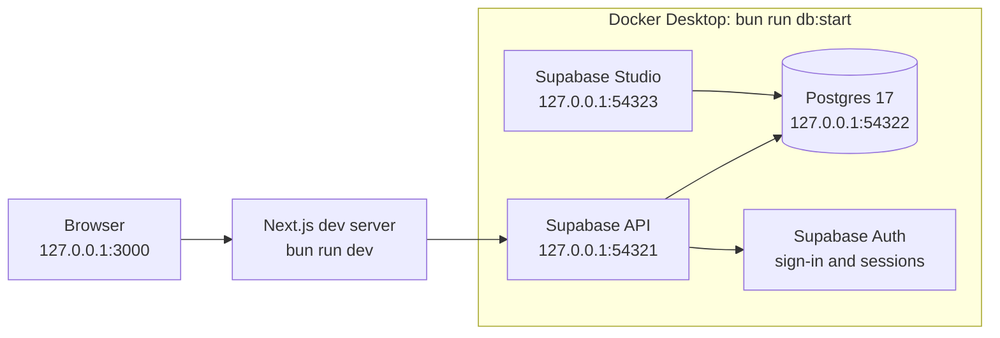
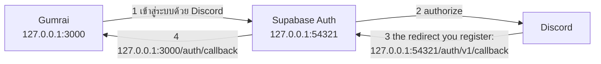

# Get Gumrai running on your machine

Follow this guide from top to bottom to go from a fresh clone to a running app, with no need to ask the project owner. Setup takes about 30 minutes. Most of that time is Docker downloading images on the first run.

## What you are setting up

Gumrai (กำไร, "profit") is a Thai-language web app. A small seller, such as a café, uses it to work out what each thing they sell costs and how much profit it leaves. Everything runs on your machine. A Next.js dev server serves the app, and a local Supabase stack runs Postgres inside Docker. Sellers sign in with email and password, or with Discord, through the local Supabase Auth. There is no deployment and no cloud account to request.



## Tech stack

| Part | Technology | Version | Location |
| --- | --- | --- | --- |
| Language | TypeScript | 7.0 | everywhere |
| Web framework | Next.js with the App Router, and React | 16.3 and 19.3 | `src/app/` |
| Styling | Tailwind CSS v4 with OKLCH colour tokens | 4.3 | `src/styles/` |
| UI components | shadcn/ui on Radix, with lucide icons | shadcn CLI 4.21 | `src/components/ui/` |
| Charts | TanStack Charts | 0.18 | `src/app/sheets/[id]/sheet-charts.tsx` |
| Database | Supabase, which runs Postgres 17 and PostgREST locally in Docker | CLI 2.118 | `supabase/` |
| Database client | supabase-js, with types generated from the schema | 2.117 | `src/server/` |
| Tests | Vitest | 5.0 | `src/**/*.test.ts` |
| Package manager and script runner | bun | 1.4 | `package.json`, `bun.lock`, and `bunfig.toml` |

`package.json` pins the exact versions. There is no separate backend service. Next.js server code talks to Supabase directly, as [ADR 0001](../adr/0001-no-fastapi-next-talks-to-supabase.md) decided.

## Install the prerequisites

Install these four tools first. Each check command prints a version when the tool is ready.

| Tool | Version | Install | Check |
| --- | --- | --- | --- |
| Git | any recent version | [git-scm.com](https://git-scm.com/) | `git --version` |
| bun | 1.4 or newer | [bun.sh](https://bun.sh). On Windows, run `powershell -c "irm bun.sh/install.ps1 \| iex"`. On macOS or Linux, run `curl -fsSL https://bun.sh/install \| bash`. | `bun --version` |
| Node.js | 22.12 or newer | [nodejs.org](https://nodejs.org/), the LTS release. bun installs the packages and runs the scripts, but Next.js itself runs on Node.js. | `node --version` |
| Docker Desktop | any recent version | [docker.com](https://www.docker.com/products/docker-desktop/). On Windows, Docker Desktop needs WSL 2, and its installer offers to set it up. | `docker info`, which fails if Docker is installed but not running |

You do not need npm, pnpm, yarn, a global Supabase CLI, or a Supabase cloud account. The Supabase CLI is a project dependency.

Keep about 5 GB of disk space free for the Supabase images. Keep port 3000 and ports 54321 to 54324 free.

## Set up the project

1. Clone the repo and open its folder.

   ```sh
   git clone <repo url> gumrai
   cd gumrai
   ```

2. Install the dependencies with bun.

   ```sh
   bun install
   ```

   bun also installs the Supabase CLI and downloads its binary. You run the CLI as `bunx supabase …`.

3. Start Docker Desktop, and wait until it reports that the engine is running.

4. Start local Supabase.

   ```sh
   bun run db:start
   ```

   The first run pulls the Docker images and takes several minutes. Later runs take seconds. When the command finishes, it prints the local URLs and keys, and the database has every migration from `supabase/migrations/`.

5. Create your environment file.

   ```sh
   cp .env.example .env.local
   ```

   In Windows PowerShell, run `Copy-Item .env.example .env.local` instead.

6. Add the local secret key to `.env.local`. Run `bunx supabase status`, and find the secret key in its output. The key is labelled `SECRET_KEY` and starts with `sb_secret_`. Paste it after `SUPABASE_SECRET_KEY=`. `SUPABASE_URL` and `SUPABASE_PUBLISHABLE_KEY` already have the right values; the publishable key is the CLI's fixed local `PUBLISHABLE_KEY`, and the app signs Sellers in with it. Only tests use the secret key. The key works only against your local Docker stack, and git ignores `.env.local`.

7. Load the sample data.

   ```sh
   bun run db:reset
   ```

   The command rebuilds the database from the migrations and then runs `supabase/seed.sql`. The seed adds a test Seller who owns eight sample Cost Items and one sample Cost Sheet. The reset deletes all local data, but a new database has none yet.

   | Test Seller | |
   | --- | --- |
   | Email | `seller@gumrai.test` |
   | Password | `gumrai-test-1234` |
   | Display Name | ร้านทดสอบ |

   The reset also deletes any Seller you signed up yourself.

8. Start the app.

   ```sh
   bun run dev
   ```

   Open it at **http://127.0.0.1:3000** or http://localhost:3000; both work. Stay on one host for a whole sign-in, because cookies set on one host are not sent to the other. Live reload on `127.0.0.1` needs `DEV_ALLOWED_ORIGINS=127.0.0.1` in `.env.local` (`.env.example` has it).

## Set up Discord sign-in

This part is optional. Without it, everything but the เข้าสู่ระบบด้วย Discord button works. Each developer registers their own Discord Application, because its secret must never be committed. It takes about 5 minutes and needs a Discord account.



1. **Create the application.** Go to https://discord.com/developers/applications and sign in. Choose **New Application**, name it (for example `Gumrai Local`), tick the box to accept Discord's terms, and click **Create**.
2. **Copy the Client ID.** Open **OAuth2** in the left menu. Under **Client information**, copy the **Client ID**. Keep it for step 5.
3. **Copy the Client Secret.** On the same page, click **Reset Secret** and confirm. Copy the **Client Secret** that appears. Discord shows it only once: if you lose it, click **Reset Secret** again, which gives a new secret and makes the old one stop working, so you then update `.env.local` too.
4. **Register the redirect.** Still on **OAuth2**, under **Redirects**, click **Add Redirect** and enter exactly:

   ```text
   http://127.0.0.1:54321/auth/v1/callback
   ```

   Click **Save Changes**. 54321 is the local Supabase API port (`[api] port` in `supabase/config.toml`). This URL is Supabase Auth's callback, not the app's: Discord sends the visitor there, and Supabase Auth then sends them on to the app's own `/auth/callback`. Discord compares it character for character, so use `http`, `127.0.0.1` and no trailing slash.
5. **Put the two values in `.env.local`.** Add these lines at the end, with the names exactly as `.env.example` lists them:

   ```sh
   SUPABASE_AUTH_EXTERNAL_DISCORD_CLIENT_ID=<the Client ID>
   SUPABASE_AUTH_EXTERNAL_DISCORD_SECRET=<the Client Secret>
   ```

   git ignores `.env.local`. Never commit the values, and never write them into `supabase/config.toml`, which reads them with `env(...)` under `[auth.external.discord]`.
6. **Restart local Supabase** so that Auth picks up the `[auth.external.discord]` settings and the two values:

   ```sh
   bun run db:stop
   bun run db:start
   ```

   `bun run db:reset` alone is not enough; any change under `[auth]` needs this restart. Run the commands through `bun run`, from the repo folder: bun loads `.env.local` and passes it to the Supabase CLI. A bare `bunx supabase start` does not, and Auth then gets the literal text `env(SUPABASE_AUTH_EXTERNAL_DISCORD_CLIENT_ID)` as the client ID.
7. **Open the app** at http://127.0.0.1:3000 or http://localhost:3000. Supabase Auth sends the sign-in back to whichever of the two you started on (both are in `additional_redirect_urls`), where the cookie holding the one-time code verifier waits. Go to `/login` and choose เข้าสู่ระบบด้วย Discord. Discord asks you to authorize your application. Accept, and you land on the Cost Sheets page as a new Seller whose Display Name is your Discord name, with your Discord avatar in the header.

### When Discord sign-in fails

| What you see | Cause and fix |
| --- | --- |
| Discord shows "Invalid OAuth2 redirect_uri" | The redirect registered in step 4 is not exactly `http://127.0.0.1:54321/auth/v1/callback`. Correct it under **OAuth2 → Redirects**, and click **Save Changes**. |
| Discord shows "Invalid OAuth2 client_id", or after Discord the login page says เข้าสู่ระบบด้วย Discord ไม่สำเร็จ ลองอีกครั้ง | The Client ID or Client Secret is wrong, or never reached Supabase Auth. A secret stops working when it is reset. Copy both again (reset the secret if you lost it), fix `.env.local`, and run `bun run db:stop` and `bun run db:start`. |
| The login page says บัญชี Discord นี้ไม่มีอีเมล … | Your Discord account has no email, and every Seller needs one. Add and verify an email in Discord (**User Settings → My Account**), then try again. |
| The login page says ยกเลิกการเข้าสู่ระบบด้วย Discord แล้ว … | You clicked **Cancel** on Discord's authorize screen. Choose เข้าสู่ระบบด้วย Discord again and click **Authorize**. |
| After Discord you land on `/`, or the login page says เข้าสู่ระบบด้วย Discord ไม่สำเร็จ ลองอีกครั้ง | Supabase Auth did not accept the callback URL, usually because it was not restarted after `additional_redirect_urls` changed, or the app was opened on a host or port it does not list. Run `bun run db:stop` and `bun run db:start`, open the app at 127.0.0.1:3000 or localhost:3000, and sign in again (step 7). |

## Check that the app runs

Open each URL, and compare the page with the expected result.

| URL | Expected result |
| --- | --- |
| http://127.0.0.1:3000 | The landing page: the title กำไร and a เริ่มใช้งาน button that opens the login page |
| http://127.0.0.1:3000/sheets | The login page, because no one is signed in. Sign in with the test Seller above. You return to the Cost Sheets page, and the header shows ร้านทดสอบ and ออกจากระบบ. |
| http://127.0.0.1:3000/cost-list | The ลิสต์ต้นทุน page with eight sample items, such as มัทฉะเกรดพิธีชง at 4.5 ฿/g |
| http://127.0.0.1:3000/sheets, again | One sheet, "มัทฉะลาเต้เย็น (แอปส่งอาหาร)". Open it and type a new Selling Price. The profit figures change as you type. |
| http://127.0.0.1:54323 | Supabase Studio. Open **Table Editor** to see `cost_item`, `cost_sheet`, and the other tables, and **Authentication** to see the Sellers. Studio uses the secret key, so it shows every Seller's rows. |

Then run the type check and the tests. Both pass with no errors on a correct setup.

```sh
bun run check
bun run test
```

`bun run check` runs the TypeScript compiler without building. `bun run test` runs Vitest, and its database tests need local Supabase to be running.

If every check passes, your setup is complete.

## Day-to-day commands

| Command | Behaviour |
| --- | --- |
| `bun run dev` | Starts the Next.js dev server on port 3000 |
| `bun run db:start` | Starts the Supabase containers |
| `bun run db:stop` | Stops the Supabase containers. Your data stays until the next reset. |
| `bun run db:reset` | Rebuilds the local database from the migrations and the seed. **It deletes all local data.** |
| `bun run db:types` | Regenerates `src/server/db/database.types.ts` after a schema change |
| `bun run test` | Runs the tests once |
| `bun run test:watch` | Runs the tests again on every file save |
| `bun run check` | Type-checks without building |
| `bun run build` and `bun run start` | Make a production build, then serve it |
| `bunx supabase migration new <name>` | Creates an empty migration file |
| `bunx supabase status` | Shows whether Supabase is running, with its URLs and keys |

## Other tools in the repo

- Supabase Studio, at http://127.0.0.1:54323, lets you browse and edit tables and run SQL. Use it to check what a save wrote.
- The shadcn CLI adds UI components. Pin a version that is at least 7 days old, for example `bunx shadcn@4.21.0 add <name>`. Restyle the new component to match [DESIGN.md](../../DESIGN.md) before you use it.
- [DESIGN.md](../../DESIGN.md) defines the design system. Open [DESIGN.html](../../DESIGN.html) in a browser to see it.
- Issues are markdown files under `.scratch/<feature>/issues/`, not GitHub Issues. [The issue tracker guide](../agents/issue-tracker.md) explains the format.
- The project is set up for Claude Code, which is optional. [CLAUDE.md](../../CLAUDE.md) holds the rules for coding agents, and the README lists [the agent skills to install](../../README.md#install-skills).

## Rules to know before your first change

[CLAUDE.md](../../CLAUDE.md) has the full list of rules. These are the ones that most often break a build or fail a review:

- Use bun for every package command. If you run `npm install` by mistake, delete `node_modules` and run `bun install`.
- `bunfig.toml` rejects any package version published less than 7 days ago. If an install fails for that reason, choose an older version. Ask the project owner before you lower the limit.
- Only code in `src/server/` talks to the database. Pages call its functions with the client from `requestClient()`, which acts as the signed-in Seller. [Sign-in](sign-in.md) explains sessions and row-level security.
- To change the schema, add a new migration, run `bun run db:types`, and commit both files. Never edit a migration that is already committed.
- Import with the `@/` alias, never with a relative path.
- Write all UI text in Thai.
- The project uses Next.js 16, and some of its APIs differ from older versions. Check `node_modules/next/dist/docs/` before you rely on what you remember.

## Troubleshooting

| Problem | Cause and fix |
| --- | --- |
| `db:start` hangs, or says it cannot connect to the Docker API | Docker Desktop is not running. Start it, wait for the engine, and run `bun run db:start` again. |
| A page shows "SUPABASE_PUBLISHABLE_KEY must be set" or "SUPABASE_SECRET_KEY must be set" | `.env.local` is missing, or a key is empty. Compare it with `.env.example`. Repeat setup steps 5 and 6, then restart `bun run dev`. |
| A page shows an error about an invalid API key | The key in `.env.local` belongs to another Supabase stack. Copy it again from `bunx supabase status`. |
| Tests fail with connection errors | Local Supabase is not running. Run `bun run db:start`. |
| `db:start` fails because a port is in use | Another Supabase project is running. Stop it with `bunx supabase stop --project-id <id>`, or stop its containers in Docker Desktop. |
| `bun install` rejects a package version as too new | The 7-day rule in `bunfig.toml` blocks it. Use an older version of that package. |
| Signing in as the test Seller fails, or the Cost List is empty after signing in | You are signed in as another Seller, or the seed has not run. Run `bun run db:reset` and sign in as `seller@gumrai.test`. |
| The sample data is gone, or the database looks wrong | Run `bun run db:reset` to rebuild everything from the migrations and the seed. |
| Discord sign-in fails | See [When Discord sign-in fails](#when-discord-sign-in-fails). |
| Port 3000 is in use | Next.js picks the next free port and prints it. Open that URL instead. |

## Where to go next

1. Read [GLOSSARY.md](../../GLOSSARY.md). The code uses these domain terms exactly, for example Cost Item, Cost Sheet, Linked Line, and Platform Take.
2. Read [Architecture](architecture.md) to learn how the code is layered.
3. Open [the documents index](INDEX.md) for the parts you will work on. Read the [v1 spec](../../.scratch/gumrai-v1/spec.md) for what the app is meant to do.
