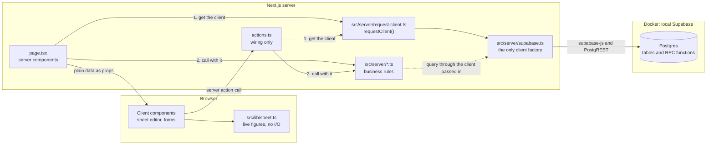

# How the code is layered

Gumrai has three layers of its own code and a database. The layers decide which code may call which, and where each business rule is enforced. Domain terms such as Cost Item and Linked Line are defined in [GLOSSARY.md](../../GLOSSARY.md).



| Layer | Path | Imports | Job |
| --- | --- | --- | --- |
| Pages | `src/app/**/page.tsx` | `src/server/*` operations, `requestClient`, components, `src/lib` | Get the client from `requestClient()`, read data on the server with it, and render. No business logic and no Supabase import. |
| Server actions | `src/app/**/actions.ts` | `src/server/*` operations, `requestClient` | Read the form or the arguments, get the client, call one operation with it, call `revalidatePath`, and turn a rule error into `{ error }`. |
| Client components | `sheet-editor.tsx` and the forms | `src/lib`, actions, and types from `src/server` | Handle interaction. The sheet editor holds a draft and computes figures in the browser. |
| Business rules | `src/server/*.ts` | the `Db` type from `src/server/supabase.ts` | Validate input, normalise it, and make every database call through the client the caller passed in. |
| Pure logic | `src/lib/*.ts` | nothing that does I/O | Sheet arithmetic in `sheet.ts` and `delivery.ts`, link and unlink in `cost-lines.ts`, and category colours. Runs on either side. |
| Database | `supabase/migrations/` | none | Schema, constraints, and the operations that need several statements in one transaction. |

## Why `src/server/` is the API

The original plan put FastAPI between Next.js and Supabase. [ADR 0001](../adr/0001-no-fastapi-next-talks-to-supabase.md) dropped it, because it would only relay calls and would double the deploys. `src/server/` took its place as the boundary. Every operation there takes plain values and returns plain values, never `FormData` and never React types. That rule matters more than it looks. If a Discord bot or a mobile app ever needs the same rules, `src/server/` is the code that moves into a separate service, and it can only move cleanly if nothing in it depends on the UI.

## How an operation gets its client

Every exported operation in `src/server/` takes the Supabase client as its first argument, typed `Db` (`SupabaseClient<Database>`, exported by `supabase.ts`). No operation makes a client of its own. The caller decides whose client it is:

| Caller | Gets the client from | Today |
| --- | --- | --- |
| A page or server action | `await requestClient()` in `src/server/request-client.ts`, called once per render or action and passed to each operation | The secret-key client |
| A test | `createServerClient()` in `src/server/supabase.ts`, once per test file | The secret-key client |

```ts
const db = await requestClient()
const [items, categories] = await Promise.all([listCostItems(db), listCostCategories(db)])
```

Pages and actions never import `supabase.ts` or `@supabase/supabase-js`. `requestClient` is the one function they use, so changing whose client the app runs as means changing that function and nothing else. It is async because a client carrying the seller's session has to read the request's cookies.

## Where a rule is enforced

A rule is enforced at the lowest layer that can hold it, and each layer above translates the result.

1. The database holds any rule that must survive buggy code. Examples are unique Cost Item names (`cost_item_owner_name_key`), a line that is exactly Linked or Manual (`cost_line_linked_or_manual`), non-negative numbers, and `on delete set null` for categories. Changes that need several statements in one transaction are Postgres functions: `save_cost_sheet`, `delete_cost_item`, and `duplicate_cost_sheet`. [Data model](data-model.md) describes each one.
2. `src/server/` validates input before it reaches the database. It trims text, checks required fields, accepts only plain decimals, and checks the shape of ids. It also turns database errors (`23505`, `23503`, `P0002`, and `22P02`) into a typed error with a Thai message.
3. A server action catches only that typed error and returns its message. Any other error is a bug, so the action throws it again.
4. The client repeats no server rule. The editor has its own `DECIMAL` check, but that check only decides what counts as 0 in the live figures. The save is what rejects bad input.

## Errors the seller sees

Each server module exports one error class:

- `CostListError` in `cost-items.ts`
- `CostCategoryError` in `cost-categories.ts`
- `CostSheetError` in `cost-sheets.ts`

The `message` of each is in Thai, and the UI shows it to the seller unchanged. A missing record is usually an error. The exceptions are the reads that expect absence: `getCostItem` and `getCostSheet` return `null`. A delete of a record that is already gone does nothing.

## How pages stay fresh

Pages are server components that call `src/server/` directly. A page whose data can change outside its own actions sets `export const dynamic = 'force-dynamic'`. The home page and the sheet editor page do this. After a write, an action calls `revalidatePath` for every page that shows the changed data. For example, saving a Manual Line into the Cost List revalidates `/cost-list`. The sheet page renders `<SheetEditor key={sheet.id}>`, so a different sheet always starts with a fresh draft.

## Why the server uses the secret key

Gumrai has one seller and no login yet. `requestClient()` therefore returns `createServerClient()`, which connects with the secret key. That key has the `service_role` and bypasses row-level security (RLS). RLS is on for every table, but no policies exist, so only the server can read data. Every owned table has a nullable `owner` column. When login arrives through Supabase Auth, `requestClient()` returns a client per request that carries the seller's session from cookies, and RLS limits each seller to their own rows. `createServerClient()` stays for tests and admin-only work.
