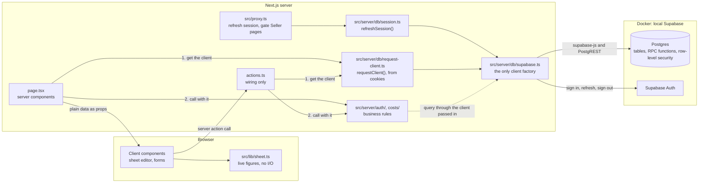

# How the code is layered

Gumrai has three layers of its own code and a database. The layers decide which code may call which, and where each business rule is enforced. Domain terms such as Cost Item and Linked Line are defined in [GLOSSARY.md](../../GLOSSARY.md).



| Layer | Path | Imports | Job |
| --- | --- | --- | --- |
| Proxy | `src/proxy.ts` | `refreshSession` from `src/server/db/session.ts`, `src/lib/return-to.ts` | Before any page renders: refresh the Seller's session and send signed-out visitors from the Seller pages to `/login`. See [Sign-in](sign-in.md). |
| Pages | `src/app/**/page.tsx` | `src/server/*` operations, `requestClient`, components, `src/lib` | Get the client from `requestClient()`, read data on the server with it, and render. No business logic and no Supabase import. |
| Server actions | `src/app/**/actions.ts` | `src/server/*` operations, `requestClient` | Read the form or the arguments, get the client, call one operation with it, call `revalidatePath`, and turn a rule error into `{ error }`. |
| Client components | `sheet-editor.tsx` and the forms | `src/lib`, actions, and types from `src/server` | Handle interaction. The sheet editor holds a draft and computes figures in the browser. |
| Business rules | `src/server/auth/*.ts`, `src/server/costs/*.ts` | the `Db` type from `src/server/db/supabase.ts` | Validate input, normalise it, and make every database call through the client the caller passed in. `auth.ts` signs in, signs up, signs out and reads the signed-in Seller the same way. |
| Pure logic | `src/lib/*.ts` | nothing that does I/O | Sheet arithmetic in `sheet.ts` and `delivery.ts`, link and unlink in `cost-lines.ts`, and category colours. Runs on either side. |
| Database | `supabase/migrations/` | none | Schema, constraints, and the operations that need several statements in one transaction. |

## Why `src/server/` is the API

The original plan put FastAPI between Next.js and Supabase. [ADR 0001](../adr/0001-no-fastapi-next-talks-to-supabase.md) dropped it, because it would only relay calls and would double the deploys. `src/server/` took its place as the boundary. Every operation there takes plain values and returns plain values, never `FormData` and never React types. That rule matters more than it looks. If a Discord bot or a mobile app ever needs the same rules, `src/server/` is the code that moves into a separate service, and it can only move cleanly if nothing in it depends on the UI.

## How `src/server/` is laid out

| Folder | Files | Holds |
| --- | --- | --- |
| `db/` | `supabase.ts`, `request-client.ts`, `session.ts`, `database.types.ts` | Making Supabase clients, the request's client from cookies, the proxy's session refresh, and the types `bun run db:types` generates. |
| `auth/` | `auth.ts`, `account.ts` | Sign-up, sign-in, sign-out and the signed-in Seller (`auth.ts`); the Seller's own account as /me shows and changes it (`account.ts`). |
| `costs/` | `cost-items.ts`, `cost-categories.ts`, `cost-sheets.ts` | The Cost List, Cost Categories and cost sheets. `seller-isolation.test.ts` lives here too. |
| `testing/` | `test-sellers.ts` | Test-only helpers. The app never imports them. |

Each test sits beside the file it tests. Imports always use the full alias path, such as `@/server/costs/cost-items`.

## How an operation gets its client

Every exported operation in `src/server/` takes the Supabase client as its first argument, typed `Db` (`SupabaseClient<Database>`, exported by `db/supabase.ts`). No operation makes a client of its own. The caller decides whose client it is:

| Caller | Gets the client from | Acts as |
| --- | --- | --- |
| A page or server action | `await requestClient()` in `src/server/db/request-client.ts`, called once per render or action and passed to each operation | The Seller whose session is in the request's cookies, or nobody (`anon`) |
| The proxy | `refreshSession(request)` in `src/server/db/session.ts` makes its own, to refresh the session | The same Seller |
| A test | `createSeller()` in `src/server/testing/test-sellers.ts`, once per test | A real Seller made for that test |
| Admin-only work (tests' setup and cleanup; deleting an account, later) | `createSecretClient()` in `src/server/db/supabase.ts` | `service_role`, which bypasses row-level security |

```ts
const db = await requestClient()
const [items, categories] = await Promise.all([listCostItems(db), listCostCategories(db)])
```

Pages and actions never import `db/supabase.ts`, `@supabase/supabase-js` or `@supabase/ssr`. `requestClient` is the one function they use. It is async because it reads the request's cookies, and it makes a new client every time, because a client holds one Seller's session.

## Where a rule is enforced

A rule is enforced at the lowest layer that can hold it, and each layer above translates the result.

1. The database holds any rule that must survive buggy code. Row-level security keeps each Seller to their own rows, and foreign keys that include `owner` stop a reference to another Seller's row. Other examples are unique Cost Item names (`cost_item_owner_name_key`), a line that is exactly Linked or Manual (`cost_line_linked_or_manual`), non-negative numbers, and `on delete set null` for categories. Changes that need several statements in one transaction are Postgres functions: `save_cost_sheet`, `delete_cost_item`, and `duplicate_cost_sheet`. [Data model](data-model.md) describes each one.
2. `src/server/` validates input before it reaches the database. It trims text, checks required fields, accepts only plain decimals, and checks the shape of ids. It also turns database errors (`23505`, `23503`, `P0002`, and `22P02`) into a typed error with a Thai message.
3. A server action catches only that typed error and returns its message. Any other error is a bug, so the action throws it again.
4. The client repeats no server rule. The editor has its own `DECIMAL` check, but that check only decides what counts as 0 in the live figures. The save is what rejects bad input.

## Errors the seller sees

Each server module exports one error class:

- `CostListError` in `cost-items.ts`
- `CostCategoryError` in `cost-categories.ts`
- `CostSheetError` in `cost-sheets.ts`
- `SignInError` in `auth.ts`, which also turns Supabase Auth's error codes into Thai
- `AccountError` in `account.ts`, for /me, which does the same for changing a password

The `message` of each is in Thai, and the UI shows it to the seller unchanged. A missing record is usually an error. The exceptions are the reads that expect absence: `getCostItem` and `getCostSheet` return `null`. A delete of a record that is already gone does nothing.

## How pages stay fresh

Pages are server components that call `src/server/` directly. A page whose data can change outside its own actions sets `export const dynamic = 'force-dynamic'`. The sheet editor page does this. A page that reads the session, such as the landing page `/`, renders on every request anyway, because reading cookies makes it dynamic. After a write, an action calls `revalidatePath` for every page that shows the changed data. For example, saving a Manual Line into the Cost List revalidates `/cost-list`. The sheet page renders `<SheetEditor key={sheet.id}>`, so a different sheet always starts with a fresh draft.

## Whose rows a client sees

Pages and actions run as the signed-in Seller, never with the secret key. Row-level security is on for every table, and each owned table has one policy: a signed-in Seller reads and changes only rows whose `owner` is them. A visitor who is not signed in (`anon`) has no policy, so sees nothing. Operations therefore need no `owner` filter of their own: `listCostItems(db)` lists the Seller's items because that is all the database shows them, and another Seller's id reads as "not found". [Sign-in](sign-in.md) describes the session and the policies.

The secret key bypasses row-level security. Only tests and admin-only operations use it, through `createSecretClient()`.
