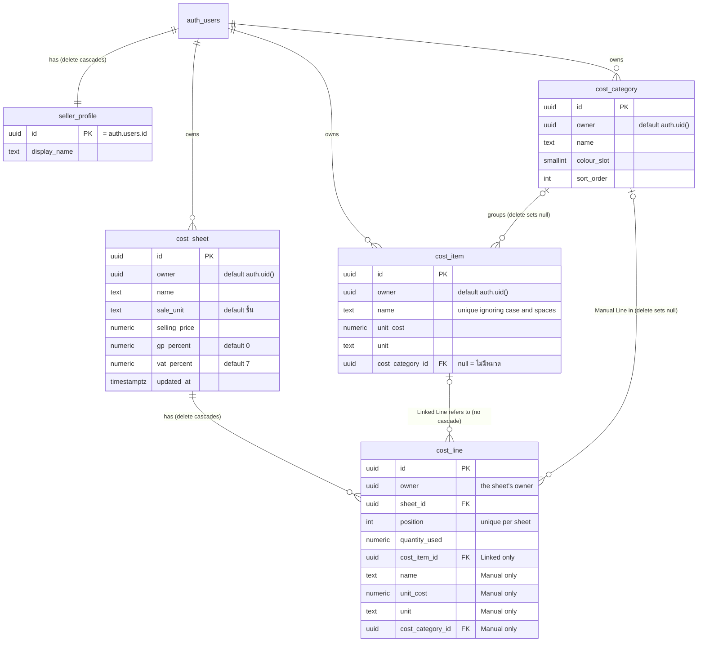

# Data model

This page describes the Postgres schema in `supabase/migrations/`, the rule that each constraint enforces, and how numbers move between the database and the app. The migrations are the source of truth.

## Tables

| Table | Holds | Notes |
| --- | --- | --- |
| `seller_profile` | A Seller's Display Name | One row per auth user, made by the `create_seller` trigger. A Seller reads and changes only their own. |
| `cost_category` | A group the seller names | `colour_slot` is an index into the fixed colour palette. `sort_order` is the list order. Each new Seller gets three (วัตถุดิบ, บรรจุภัณฑ์, and อื่น ๆ) from `create_seller`, because they are part of the product and not sample data. |
| `cost_item` | One entry in the Cost List | `unit_cost` is `numeric`. `unit` is free text. `cost_category_id` is nullable. |
| `cost_sheet` | One costing of a thing the seller sells | `sale_unit` defaults to ชิ้น, `gp_percent` to 0, and `vat_percent` to 7. |
| `cost_line` | One cost on a sheet | `position` starts at 0. A line has either `cost_item_id` or its own `name`, `unit_cost`, `unit`, and `cost_category_id`. |

Every owned table (`cost_category`, `cost_item`, `cost_sheet`, `cost_line`) has a required `owner`, the Seller's `auth.users` id. It defaults to `auth.uid()`, the signed-in Seller, so the app never sends it. Row-level security lets a Seller read and change only rows they own; [Sign-in](sign-in.md) describes the policies. Deleting a Seller deletes everything they own. A Seller does that from `/me` with `deleteAccount` ([Sign-in](sign-in.md#deleting-the-account)), which deletes their `auth.users` row with the secret key and lets the trigger and the cascades below do the rest.

The `seller_sign_in` migration deleted every row that had no owner, including the old ownerless starting categories.

## Triggers on `auth.users`

| Trigger | When | Behaviour |
| --- | --- | --- |
| `create_seller_on_signup` → `create_seller()` | After a user is inserted | Inserts the `seller_profile` row and the three starting Cost Categories, in the same transaction as the user. The Display Name is `raw_user_meta_data.display_name` (an email sign-up), else `custom_claims.global_name` (the display name chosen on Discord), else `full_name` (the Discord username), else `name`, else the part of the email before `@`. It runs only on insert, so a later change on Discord never reaches the Display Name. The `discord_sign_in` migration redefines it to add `global_name`. |
| `delete_seller_sheets_on_user_delete` → `delete_seller_sheets()` | Before a user is deleted | Deletes the Seller's sheets, and so their lines, first. Postgres cascades the owner keys one table at a time, and a line still linked to a Cost Item would block the item's delete. The owner keys then cascade to `seller_profile`, `cost_category` and `cost_item`. This is how deleting an account (`deleteAccount`) removes all of a Seller's data. |

Both run `security definer`, because Supabase Auth inserts and deletes users with no Seller session.

## Constraints that enforce rules

| Constraint | Rule |
| --- | --- |
| `cost_item_owner_name_key`, a unique index on `(owner, lower(btrim(name)))` | Cost Item names are unique per Seller, ignoring case and surrounding spaces. Two Sellers may each have the same name. |
| Foreign keys that include `owner`: `(owner, cost_category_id)`, `(owner, cost_item_id)`, and `(owner, sheet_id)`, each pointing at the target's `unique (owner, id)` | A reference never crosses Sellers. Postgres checks a foreign key without row-level security, so a plain `cost_item_id` would let Seller B link to Seller A's item by id. With `owner` in the key, it only matches a row of the same owner, and B gets the usual `23503`, as for an item that does not exist. The constraint names are unchanged, because `src/server/` reads them from the error. |
| `cost_line_linked_or_manual` | A Linked Line has only `cost_item_id`. A Manual Line has `name`, `unit_cost`, and `unit`, and no `cost_item_id`. A Linked Line stores no copy of the item's values. |
| `cost_line.cost_item_id` with no `on delete` action | A Cost Item that a line links to cannot be deleted directly. `delete_cost_item` unlinks the lines first, as [ADR 0002](../adr/0002-cost-lines-link-to-the-cost-list.md) requires. |
| `... on delete set null (cost_category_id)`, on items and on lines | Deleting a category moves its costs to ไม่มีหมวด in the same statement. The column list clears only the category, never `owner`. |
| `unique (sheet_id, position)` | Lines keep their order. `save_cost_sheet` rewrites the positions from 0 each time. |
| `check (... >= 0)` and `check (btrim(x) <> '')` | Money and quantities are never negative. Names and units are never blank. |

## Postgres functions

Each function runs as one transaction and uses `search_path = ''`. The app calls them with `rpc()`. They are executable by `authenticated` (a signed-in Seller) and `service_role`, never by `anon`. They run as the caller (security invoker), so row-level security applies inside them: another Seller's sheet or item is simply not found. `save_cost_sheet` and `duplicate_cost_sheet` write each line's `owner` from its sheet.

| Function | Caller | Behaviour |
| --- | --- | --- |
| `save_cost_sheet(p_sheet_id, p_sheet jsonb, p_lines jsonb)` | `saveCostSheet` | Updates the sheet's fields and `updated_at`, deletes all its lines, and inserts `p_lines` in array order. A line object with `cost_item_id` becomes a Linked Line. A line object with `name`, `unit_cost`, and `unit` becomes a Manual Line. Raises `P0002` if the sheet is missing, and `23503` if a Cost Item or category is missing. |
| `delete_cost_item(p_id)` | `deleteCostItem` | Locks the item, copies its name, Unit Cost, Unit, and category into every line that links to it, and then deletes it. Those lines become Manual Lines, so no sheet's figures change. |
| `duplicate_cost_sheet(p_sheet_id, p_name)` | `duplicateCostSheet` | Inserts a copy of the sheet and of all its lines, and returns the new id. Linked Lines in the copy link to the same items. |

Four more functions are not transactions but narrow windows into the `auth` schema:

| Function | Caller | Behaviour |
| --- | --- | --- |
| `seller_has_password()` | `readAccount`, `changePassword`, `setFirstPassword`, `listSignInMethods` | Whether the signed-in Seller has a password: `true` when their `auth.users.encrypted_password` is neither null nor empty. It is `security definer`, because the app cannot read `auth.users`, and it reads only the caller's own row and returns only a yes or no. Executable by `authenticated` only. |
| `seller_discord_avatar()` | `currentSeller` (the header) | The avatar URL in the signed-in Seller's own `discord` identity (`auth.identities.identity_data.avatar_url`), or null when they have none. `security definer`, reads only the caller's identity, executable by `authenticated` only. It reads the identity rather than the user's metadata because binding Discord later does not write the metadata, and a Seller can write their own. The generated type says it returns `string`, because the type generator marks every scalar function result non-null; `discordAvatar` in `src/server/auth/auth.ts` types it as `string \| null`. |
| `seller_clear_password()` | `unbindSignInMethod(db, 'email', currentPassword)`, after the app has checked the current password | Empties the signed-in Seller's `auth.users.encrypted_password`, so email and password no longer signs them in (Supabase Auth's API can change a password but not remove one). Raises `P0001` "no other way to sign in" unless the Seller has a `discord` identity. `security definer`, acts only on the caller's row, executable by `authenticated` only. |
| `seller_add_email_identity()` | `unbindSignInMethod(db, 'discord')` | Inserts an `email` identity for the signed-in Seller, as Supabase Auth stores one for an email sign-up, so that Supabase Auth will unlink their Discord identity (it refuses to unlink a user's only identity, and setting a password adds none). Does nothing unless the Seller has a password and a confirmed email and no `email` identity yet. Its `email_verified` is true only when another of the Seller's identities has the same email and says its provider verified it (`20261010090817_email_identity_evidence.sql`); `email_confirmed_at` is no evidence while confirmations are off. `security definer`, acts only on the caller, executable by `authenticated` only. |

Two trigger functions guard `auth.identities` ([Refusing automatic linking](sign-in.md#refusing-automatic-linking)). `note_auth_user_created()`, after insert on `auth.users`, notes each new user's id in the transaction-local setting `gumrai.users_created`. `refuse_automatic_link()`, a deferred constraint trigger after insert on `auth.identities` for every provider but `email`, raises `PT403` `automatic_link_refused` at commit unless the transaction created the identity's user or marked a bind flow state of that user (`auth.flow_state.linking_target_id`) as used. Both are `security definer` and executable by no API role.

The `linked_lines` migration redefines `save_cost_sheet` with `create or replace`. A later migration redefines a function instead of editing the migration that created it.

## Numbers in the app are decimal strings

Money, percentages, and quantities are Postgres `numeric`. They never pass through a JavaScript `number` between the database and the app.

- On read, each select list casts these columns to text, for example `unit_cost::text`. PostgREST then returns `"0.075"`, not a float. Each select list is a single string literal, so supabase-js can infer the row type from it.
- In the app types, `CostItem.unitCost`, `CostSheet.sellingPrice`, `LinkedLine.quantityUsed`, and the other number fields are `string`.
- On write, `src/server/` checks the input against `DECIMAL = /^-?(\d+\.?\d*|\.\d+)$/`. The pattern accepts plain decimals and rejects input such as `1e3` and `4 บาท`. Negative values are rejected next. Postgres then casts the string to `numeric`. The generated insert type says `number`, which is why `cost-items.ts` contains `as unknown as number`.
- Arithmetic happens only in `src/lib/sheet.ts`. The sheet editor converts the strings to numbers just before it calls the calculation. `Intl.NumberFormat` rounds the figures on screen. Stored values are never rounded.

The steps for a schema change are in [CLAUDE.md](../../CLAUDE.md#database).
