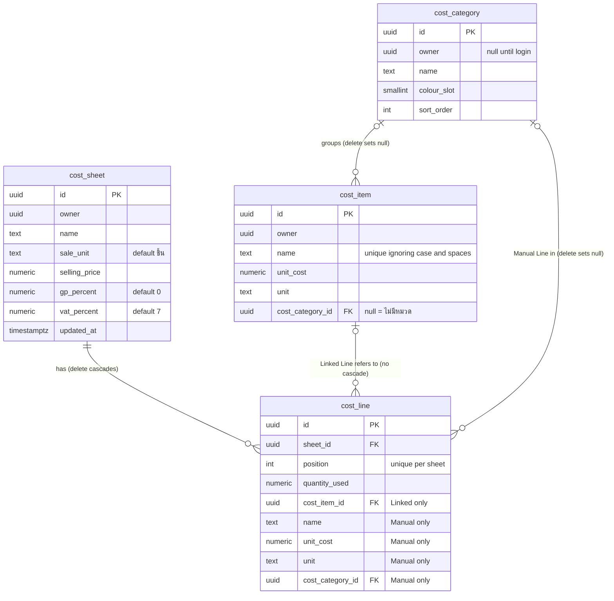

# Data model

This page describes the Postgres schema in `supabase/migrations/`, the rule that each constraint enforces, and how numbers move between the database and the app. The migrations are the source of truth.

## Tables

| Table | Holds | Notes |
| --- | --- | --- |
| `cost_category` | A group the seller names | `colour_slot` is an index into the fixed colour palette. `sort_order` is the list order. A migration inserts three rows (วัตถุดิบ, บรรจุภัณฑ์, and อื่น ๆ), because they are part of the product and not sample data. |
| `cost_item` | One entry in the Cost List | `unit_cost` is `numeric`. `unit` is free text. `cost_category_id` is nullable. |
| `cost_sheet` | One costing of a thing the seller sells | `sale_unit` defaults to ชิ้น, `gp_percent` to 0, and `vat_percent` to 7. |
| `cost_line` | One cost on a sheet | `position` starts at 0. A line has either `cost_item_id` or its own `name`, `unit_cost`, `unit`, and `cost_category_id`. |
| `app_status` | One row that the home page reads | A test table from the project scaffold, outside the domain. It is removed once nothing reads it. |

Every owned table has `owner uuid references auth.users`. The value is always null until login exists.

## Constraints that enforce rules

| Constraint | Rule |
| --- | --- |
| `cost_item_owner_name_key`, a unique index on `(owner, lower(btrim(name))) nulls not distinct` | Cost Item names are unique, ignoring case and surrounding spaces. Every row has a null owner today, and without `nulls not distinct` no two names would ever clash. |
| `cost_line_linked_or_manual` | A Linked Line has only `cost_item_id`. A Manual Line has `name`, `unit_cost`, and `unit`, and no `cost_item_id`. A Linked Line stores no copy of the item's values. |
| `cost_line.cost_item_id` with no `on delete` action | A Cost Item that a line links to cannot be deleted directly. `delete_cost_item` unlinks the lines first, as [ADR 0002](../adr/0002-cost-lines-link-to-the-cost-list.md) requires. |
| `cost_category_id ... on delete set null`, on items and on lines | Deleting a category moves its costs to ไม่มีหมวด in the same statement. |
| `unique (sheet_id, position)` | Lines keep their order. `save_cost_sheet` rewrites the positions from 0 each time. |
| `check (... >= 0)` and `check (btrim(x) <> '')` | Money and quantities are never negative. Names and units are never blank. |

## Postgres functions

Each function runs as one transaction, uses `search_path = ''`, and is executable only by `service_role`. The app calls them with `rpc()`.

| Function | Caller | Behaviour |
| --- | --- | --- |
| `save_cost_sheet(p_sheet_id, p_sheet jsonb, p_lines jsonb)` | `saveCostSheet` | Updates the sheet's fields and `updated_at`, deletes all its lines, and inserts `p_lines` in array order. A line object with `cost_item_id` becomes a Linked Line. A line object with `name`, `unit_cost`, and `unit` becomes a Manual Line. Raises `P0002` if the sheet is missing, and `23503` if a Cost Item or category is missing. |
| `delete_cost_item(p_id)` | `deleteCostItem` | Locks the item, copies its name, Unit Cost, Unit, and category into every line that links to it, and then deletes it. Those lines become Manual Lines, so no sheet's figures change. |
| `duplicate_cost_sheet(p_sheet_id, p_name)` | `duplicateCostSheet` | Inserts a copy of the sheet and of all its lines, and returns the new id. Linked Lines in the copy link to the same items. |

The `linked_lines` migration redefines `save_cost_sheet` with `create or replace`. A later migration redefines a function instead of editing the migration that created it.

## Numbers in the app are decimal strings

Money, percentages, and quantities are Postgres `numeric`. They never pass through a JavaScript `number` between the database and the app.

- On read, each select list casts these columns to text, for example `unit_cost::text`. PostgREST then returns `"0.075"`, not a float. Each select list is a single string literal, so supabase-js can infer the row type from it.
- In the app types, `CostItem.unitCost`, `CostSheet.sellingPrice`, `LinkedLine.quantityUsed`, and the other number fields are `string`.
- On write, `src/server/` checks the input against `DECIMAL = /^-?(\d+\.?\d*|\.\d+)$/`. The pattern accepts plain decimals and rejects input such as `1e3` and `4 บาท`. Negative values are rejected next. Postgres then casts the string to `numeric`. The generated insert type says `number`, which is why `cost-items.ts` contains `as unknown as number`.
- Arithmetic happens only in `src/lib/sheet.ts`. The sheet editor converts the strings to numbers just before it calls the calculation. `Intl.NumberFormat` rounds the figures on screen. Stored values are never rounded.

The steps for a schema change are in [CLAUDE.md](../../CLAUDE.md#database).
