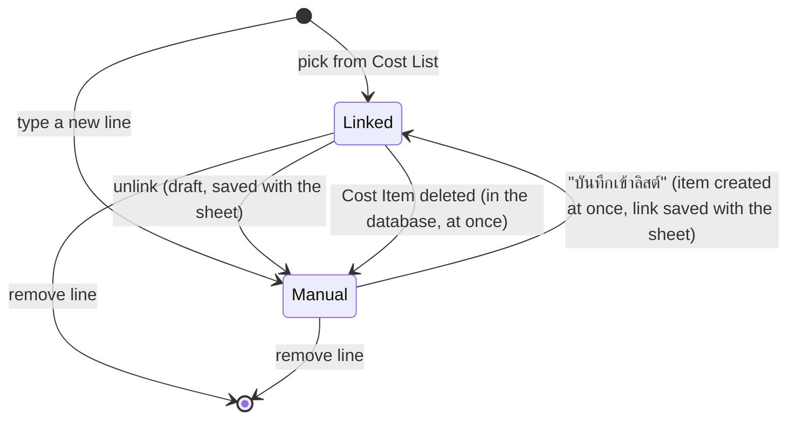
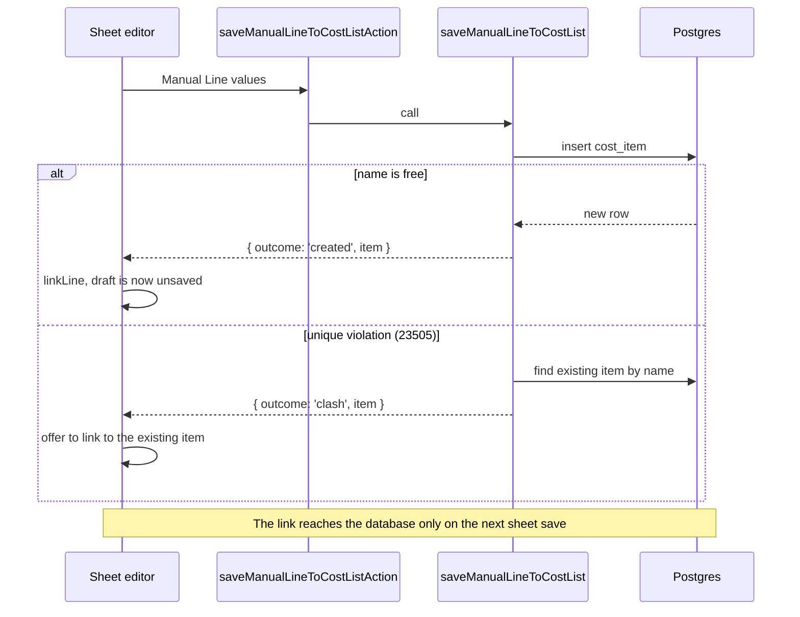

# About Linked and Manual Lines

A Cost Line can follow the Cost List or hold its own values. This choice touches the schema, the server rules, and the sheet editor, so it is the behaviour most likely to surprise you. [ADR 0002](../adr/0002-cost-lines-link-to-the-cost-list.md) records the decision, and [GLOSSARY.md](../../GLOSSARY.md) defines the terms.

## Two kinds of line

| | Linked Line | Manual Line |
| --- | --- | --- |
| Columns stored in `cost_line` | `cost_item_id`, `quantity_used` | `name`, `unit_cost`, `unit`, `cost_category_id`, `quantity_used` |
| Source of the name, Unit Cost, Unit, and category | The Cost Item, read each time the sheet loads | The line itself |
| Type in `src/server/costs/cost-sheets.ts` | `LinkedLine { kind: 'linked', costItemId, … }` | `ManualLine { kind: 'manual', … }` |
| Type for a save | `LinkedLineInput { costItemId, quantityUsed }` | `ManualLineInput` |

`readSheet` joins `cost_item` into each line and fills a Linked Line with the item's current values. The editor and the calculation never need to know where a value came from.

The consequence is deliberate. A saved sheet's figures change whenever a Cost Item that it links to changes, with no edit to the sheet. A seller updates a price once, and every sheet follows. The edit page for a Cost Item shows "ใช้อยู่ใน N ชีต" so the seller sees how many sheets a change reaches before saving. `countSheetsUsingCostItem` counts distinct sheets, so two lines on one sheet count once.

## How a line changes kind

### Pick from the Cost List

`addLinkedLine` in `sheet-editor.tsx` adds a draft line that carries the item's values for display. A save stores only `costItemId` and `quantityUsed`.

### Unlink

`unlinkLine` in `src/lib/cost-lines.ts` turns a Linked Line into a Manual Line. The Manual Line holds the values that the line shows at that moment, so the figures stay the same and later changes to the item no longer reach it. Unlink is a draft edit, and the database sees it on the next sheet save. A seller unlinks to use a one-off figure, such as a supplier's promotional price, without changing the Cost Item.

### Save a Manual Line into the Cost List

The **บันทึกเข้าลิสต์** action commits in two steps on purpose. The sheet is saved only when the seller presses save, but the Cost List changes at once.

1. `saveManualLineToCostListAction` calls `saveManualLineToCostList`, which inserts a Cost Item immediately, whether or not the sheet is saved.
   - If the name is free, the call returns `{ outcome: 'created', item }`. The editor adds the item to its local copy of the Cost List and calls `linkLine` to turn the draft line into a Linked Line.
   - If the name already exists, the insert fails with a unique violation and nothing is created. The call returns `{ outcome: 'clash', item }` with the existing item, and the editor offers to link the line to it.
2. The switch to a Linked Line is a draft edit. The next sheet save stores it.

If the seller leaves without saving the sheet, the new Cost Item stays in the Cost List, and the sheet keeps its Manual Line.

### Delete a Cost Item

`deleteCostItem` calls `delete_cost_item`, which works in one transaction. Every Linked Line to the item becomes a Manual Line with the item's last name, Unit Cost, Unit, and category. Then the item is deleted. Before the delete, the UI asks for confirmation and shows how many sheets use the item. Sheet totals are the same afterwards, and a test in `cost-items.test.ts` checks this.

### Delete a Cost Category

Both `cost_item` and `cost_line` have `on delete set null` on their category. Items and Manual Lines in the deleted category move to ไม่มีหมวด. A Linked Line has no category of its own, so it follows its item. An editor that was open before the delete shows the category as ไม่มีหมวด, because `categoryLooks` treats an unknown id as no category.

## Duplicating a sheet

`duplicate_cost_sheet` copies each line as it is. Linked Lines in the copy link to the same items. Manual Lines are copied by value. After that, the two sheets are independent, and an edit to the lines of one leaves the other alone. Sellers use this to compare channels, for example a shop price against a delivery app price with GP.
