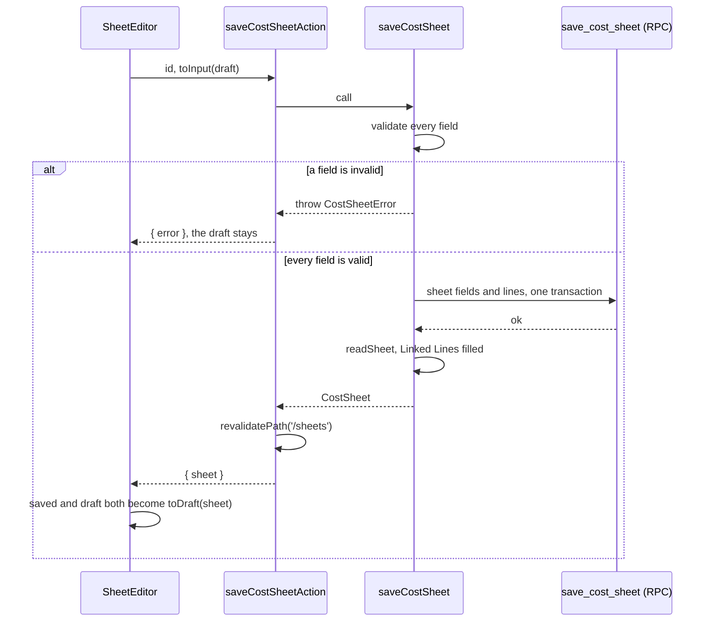

# About the sheet editor

`src/app/sheets/[id]/sheet-editor.tsx` is the one large client component in the app. It holds the seller's edits in the browser until the seller presses save, and it recomputes the figures on every keystroke. This page explains how it does both.

## Loading

`src/app/sheets/[id]/page.tsx` is a server component with `force-dynamic`. It loads three things in parallel:

- the sheet, with Linked Lines filled from their Cost Items, through `getCostSheet`
- the whole Cost List, through `listCostItems`, for the search that adds a line
- the categories, through `listCostCategories`

It then renders `<SheetEditor key={sheet.id} saved={sheet} …>`.

## Draft and saved state

The editor keeps two copies of the sheet in the same shape. `saved` is the last state the server confirmed. `draft` is what the seller is editing.

Each draft line has a `key` that exists only in the browser, such as `line-0` or `line-1`. The editor cannot use the database id, because `save_cost_sheet` deletes and reinserts every line, so the ids change on each save. A Linked Line in the draft carries its item's values for display, but `toLineInput` reduces it to `{ costItemId, quantityUsed }` for the save.

The sheet has unsaved edits when `JSON.stringify(toInput(draft))` differs from `JSON.stringify(toInput(saved))`. The comparison uses only what a save would send, so a field that exists only for display can never mark the sheet as changed. While the sheet has unsaved edits, the header shows "● ยังไม่บันทึก", the **บันทึก** button is enabled, and leaving the page asks first.

## Live figures

The editor runs `computeSheet` inside a `useMemo` over the draft. Each change recomputes the figures in the browser, with no call to the server. [Sheet calculation](sheet-calculation.md) describes the formulas.

## Saving

A save is all or nothing. The sheet's fields and all its lines are saved together, or nothing is saved.

After a successful save, Linked Lines show their items' current values, and every line has a new `key`.

## Actions that take effect without a save

Two kinds of action change the database before the seller presses save:

- **บันทึกเข้าลิสต์** on a Manual Line creates the Cost Item at once. The line becomes a Linked Line only when the sheet is saved. [Linked and Manual Lines](linked-and-manual-lines.md) explains this.
- Rename, duplicate, and delete act on a whole sheet, from the sheet list at `/sheets`. Each is its own server action. Delete asks for confirmation through `ConfirmAction`.

## Behaviour that surprises people

- A sheet always shows today's Unit Cost for each Linked Line, both while it has unsaved edits and when the seller opens it again later. [ADR 0002](../adr/0002-cost-lines-link-to-the-cost-list.md) intends this.
- The `beforeunload` listener covers only closing or reloading the tab. Each in-app link out of the editor has its own guard. The "← ชีตต้นทุน" link asks for confirmation in its `onNavigate` handler. A new link out of the editor needs the same handler.
- When a Manual Line is saved into the Cost List, the editor adds the new item to its own `costItems` list. The search that adds a line then finds the item without a reload.
