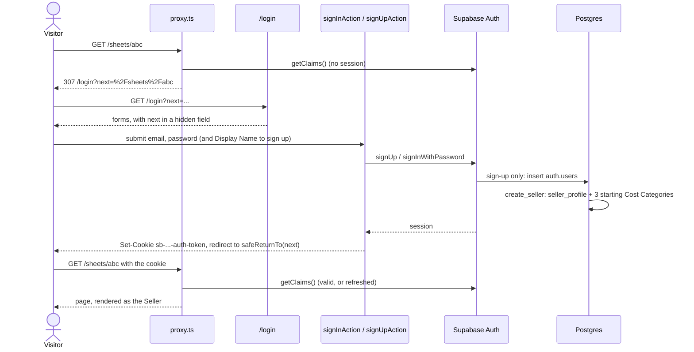
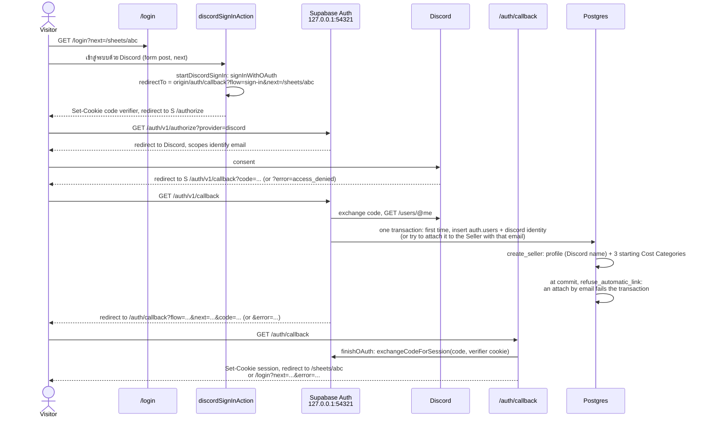
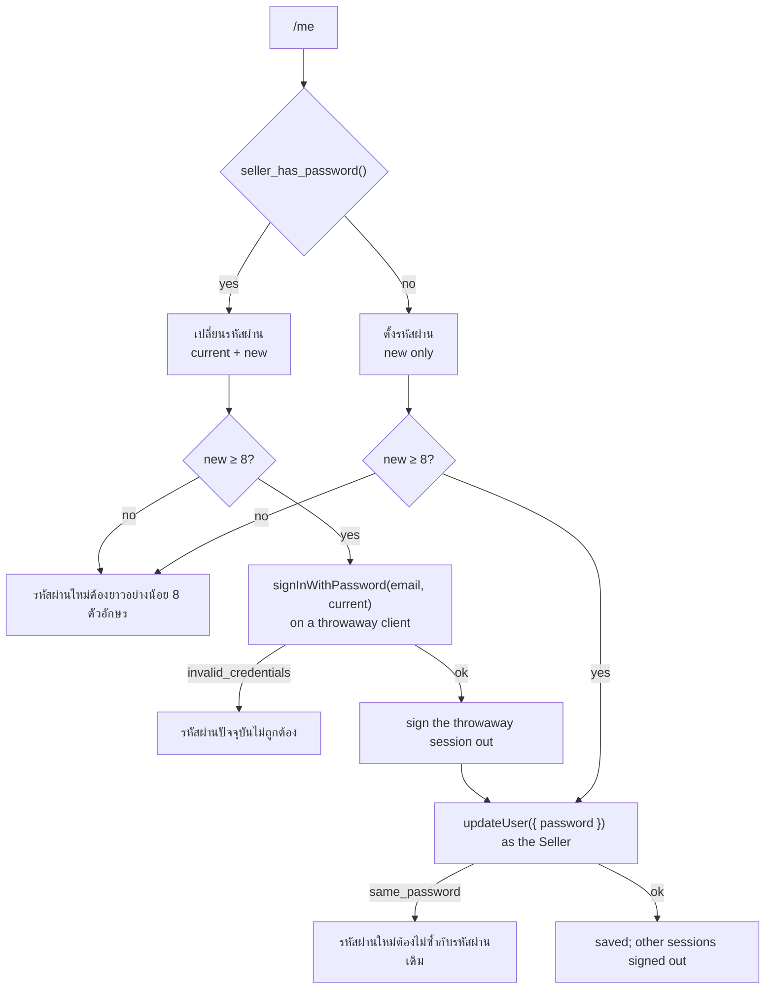
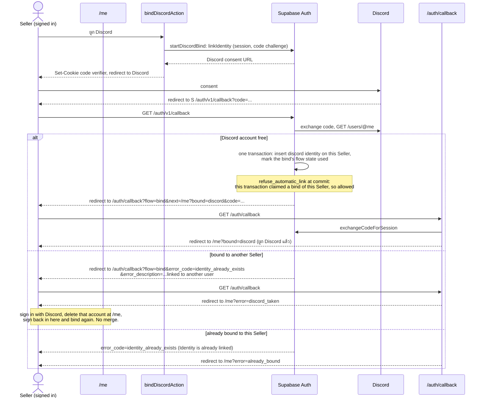
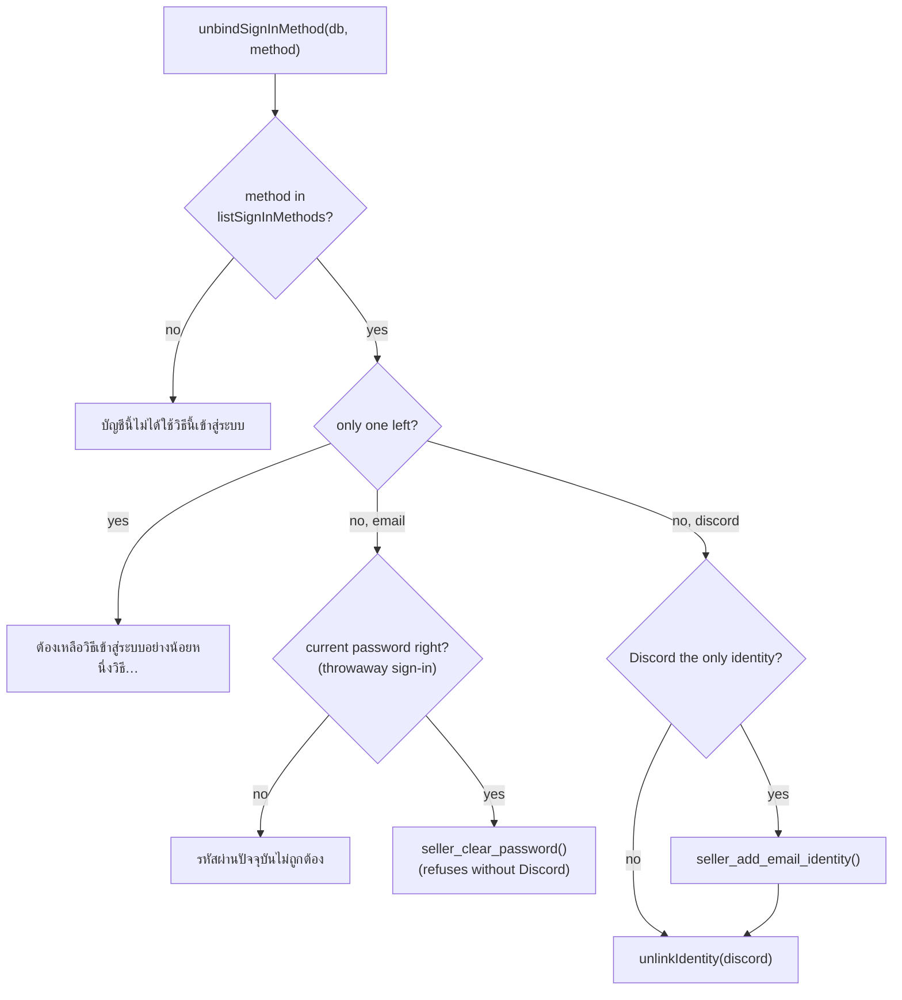
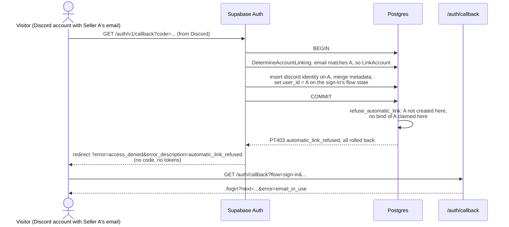
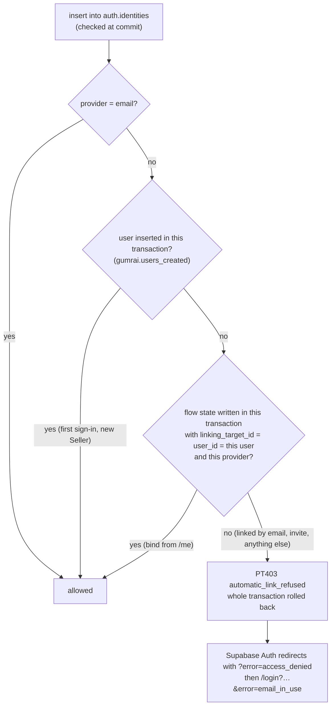
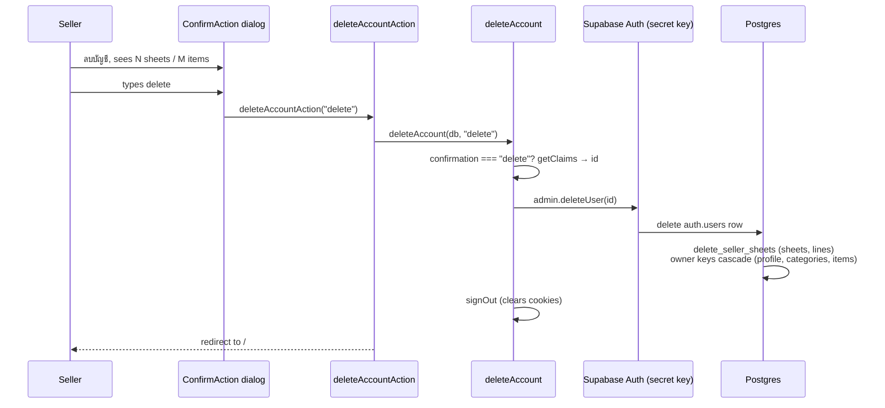
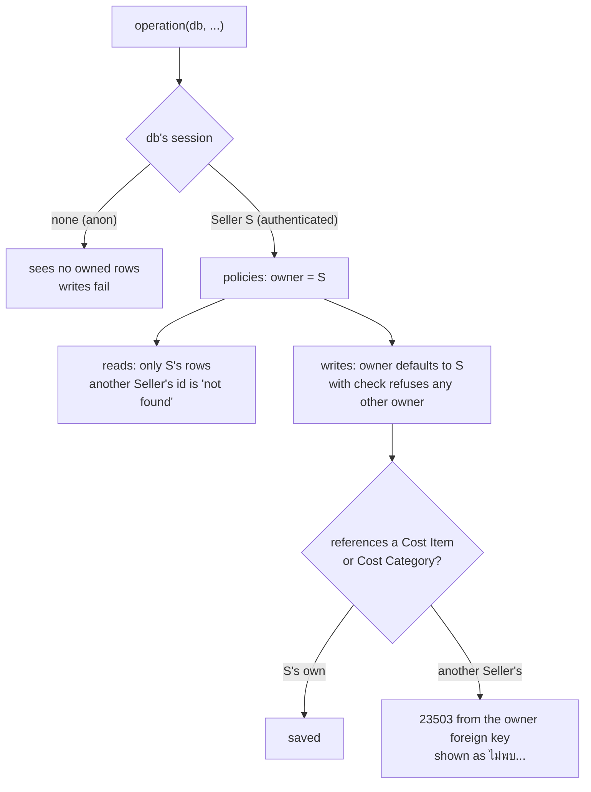

# Sign-in, sessions and row-level security

This page explains how a Seller signs up and signs in with email or Discord, how their session travels with each request, how they change their Display Name and password, bind and unbind ways to sign in and delete their account at `/me`, and how the database keeps each Seller to their own data. Seller and Display Name are defined in [GLOSSARY.md](../../GLOSSARY.md).

## The parts

| Part | Path | Job |
| --- | --- | --- |
| Login page | `src/app/login/page.tsx`, `login-forms.tsx` | A เข้าสู่ระบบด้วย Discord button, a sign-in form and a sign-up form. `?next=` is the page to go to afterwards; `?error=` is a Discord failure to explain. A signed-in Seller who opens it goes straight there. |
| Auth actions | `src/app/login/actions.ts` | `signInAction`, `signUpAction`, `discordSignInAction` and `signOutAction`. Wiring only. |
| Auth operations | `src/server/auth/auth.ts` | `signUpWithEmail`, `signInWithEmail`, `signOut`, `currentSeller` and `sessionSeller` (the verified session's Seller id and email, shared with the account operations), plus `SignInError`. |
| OAuth operations | `src/server/auth/oauth.ts` | `startDiscordSignIn`, `startDiscordBind`, `finishOAuth`, `oauthCallbackUrl`, `oauthFailureMessage` and `AUTOMATIC_LINK_REFUSED`. |
| OAuth callback | `src/app/auth/callback/route.ts` | A Route Handler: `GET /auth/callback` calls `finishOAuth` and redirects where it says. Wiring only. |
| Header avatar | `src/app/seller-avatar.tsx`, `src/lib/avatar.ts` | The Discord avatar, or the Display Name's first letter (`sellerAvatar`). |
| Request client | `src/server/db/request-client.ts` | `requestClient()`: a new client per request, reading and writing the session cookies through `next/headers`. |
| Request origin | `src/server/db/request-origin.ts` | `requestOrigin()`: the site's origin as the browser sees it, for the OAuth callback URL. Used by `discordSignInAction` and `bindDiscordAction`. |
| Proxy | `src/proxy.ts`, `src/server/db/session.ts` | Runs before every page. Refreshes the session and sends signed-out visitors from the Seller pages to the login page. |
| Seller frame | `src/app/seller-shell.tsx`, used by the layouts of `src/app/sheets/`, `src/app/cost-list/` and `src/app/me/` | Checks the Seller again and shows the header: the avatar and Display Name, which link to `/me`, and ออกจากระบบ. |
| Account page | `src/app/me/page.tsx`, `account-forms.tsx`, `actions.ts` | `/me`: rename the Display Name, change or set the password, bind and unbind ways to sign in (`bindDiscordAction`, `unbindDiscordAction`, `unbindEmailAction`), delete the account, ออกจากระบบ. `?bound=` and `?error=` come back from binding Discord. |
| Account operations | `src/server/auth/account.ts` | `readAccount`, `renameDisplayName`, `changePassword`, `setFirstPassword`, `listSignInMethods`, `unbindSignInMethod`, `countAccountData` and `deleteAccount`, plus `AccountError`. |
| Return-to | `src/lib/return-to.ts` | `safeReturnTo`, `loginPath` and `RETURN_TO_HEADER`. |
| Database | `supabase/migrations/20261010075658_seller_sign_in.sql`, `20261010081520_seller_has_password.sql`, `20261010083051_discord_sign_in.sql`, `20261010084739_sign_in_methods.sql`, `20261010090815_refuse_automatic_linking.sql`, `20261010090817_email_identity_evidence.sql` | Owners, row-level security policies, `seller_profile`, the triggers on `auth.users`, `refuse_automatic_link` on `auth.identities`, `seller_has_password()`, `seller_discord_avatar()`, `seller_clear_password()` and `seller_add_email_identity()`. |
| Auth settings | `supabase/config.toml`, `[auth]`, `[auth.email]` and `[auth.external.discord]` | `minimum_password_length = 8`, `enable_confirmations = false`, `enable_manual_linking = true` (binding at `/me`), the callback in `additional_redirect_urls`, and the Discord provider with its client ID and secret from the environment. |

## Signing up and signing in

- Signing up needs no email confirmation, so the new Seller is signed in at once. The Display Name they typed is stored in the user's metadata as `display_name`, and the `create_seller` trigger copies it into `seller_profile` in the same transaction as the user.
- Passwords are at least 8 characters. `signUpWithEmail` checks this before calling Supabase Auth, and Auth itself refuses shorter ones (`minimum_password_length`). A password is never trimmed.
- After signing in or up, the action calls `revalidatePath('/', 'layout')`, so no page rendered for the signed-out visitor is reused, and redirects to `safeReturnTo(next)`.

### Errors the visitor sees

`src/server/auth/auth.ts` turns Supabase Auth's error codes into a `SignInError` with a Thai message. Any other error is unexpected and is thrown.

| Case | Auth code | Message |
| --- | --- | --- |
| Wrong password, or no Seller with that email | `invalid_credentials` | อีเมลหรือรหัสผ่านไม่ถูกต้อง |
| Email already has a Seller | `user_already_exists`, `email_exists` | อีเมลนี้มีบัญชีอยู่แล้ว ลองเข้าสู่ระบบแทน |
| Password shorter than 8 | checked first; `weak_password` | รหัสผ่านต้องยาวอย่างน้อย 8 ตัวอักษร |
| Email Auth cannot accept | `email_address_invalid`, `validation_failed` | รูปแบบอีเมลไม่ถูกต้อง |
| Too many attempts | `over_request_rate_limit` | ลองหลายครั้งเกินไป รอสักครู่แล้วลองใหม่ |
| Blank email, password or Display Name | checked first | ต้องใส่อีเมล, ต้องใส่รหัสผ่าน, ต้องใส่ชื่อที่แสดง |

## Signing in with Discord

Supabase Auth runs the OAuth flow with Discord, with PKCE. The app never sees a Discord token; it gets a Supabase session like an email sign-in does. Setting up the Discord Application is in [Onboarding](ONBOARDING.md#set-up-discord-sign-in).

- **Starting.** `discordSignInAction` takes the site's origin from the form post's `Origin` header and calls `startDiscordSignIn(db, origin, next)`. It must run in a server action: `signInWithOAuth` keeps the PKCE code verifier in a cookie (`sb-…-auth-token-code-verifier`) until the callback, and a page cannot write cookies.
- **The callback is a Route Handler**, `src/app/auth/callback/route.ts`, for the same reason: exchanging the code writes the session cookies. It calls `finishOAuth(db, searchParams)`, revalidates every page and redirects to the path `finishOAuth` returns.
- **The callback URL carries the flow and the return-to page**: `/auth/callback?flow=sign-in&next=…`, built by `oauthCallbackUrl`. `next` goes through `safeReturnTo` both when the URL is built and when it is read. `flow` says where a failure goes back to: for `sign-in`, the login page as `/login?next=…&error=<failure>`. For `bind` ([Binding and unbinding ways to sign in](#binding-and-unbinding-ways-to-sign-in)), `/me?error=<failure>`. An unknown `flow` is treated as `sign-in`. Both come from the browser, so the visitor can change them; nothing about who may sign in depends on them.
- **Supabase Auth checks the callback URL.** It accepts a `redirectTo` on the host of `site_url` (`http://127.0.0.1:3000`) or one matching `additional_redirect_urls` (`http://127.0.0.1:3000/auth/callback**` and `http://localhost:3000/auth/callback**`). Any other one is silently replaced by `site_url`, so the visitor lands on `/` with nothing to finish the flow.
- **The sign-in must stay on one host.** Cookies belong to a host, so the code verifier set on `localhost:3000` is not sent to `127.0.0.1:3000`. Because the callback URL is built from the host the sign-in started on, and both local hosts are allowed, either works.
- **A first Discord sign-in makes a new Seller.** Supabase Auth inserts the auth user with Discord's profile as its metadata, and `create_seller` makes the profile and the starting Cost Categories ([A new Seller](#a-new-seller)). Supabase Auth does not ask for email confirmation here (`enable_confirmations = false`). A later sign-in with the same Discord account finds the `discord` identity and signs into the same Seller. After that Seller deletes their account, the identity is gone too, so the next Discord sign-in makes a new Seller from scratch.
- **A Discord email that already belongs to a Seller is refused.** Supabase Auth links identities by email on its own (`DetermineAccountLinking` in supabase/auth `internal/models/linking.go`, checked at v2.197.0, the local image): a first Discord sign-in whose email matches an existing Seller is attached to that Seller (a new `discord` identity, and the Discord profile merged into their metadata) and signs into them, rather than making a second Seller. It counts an email as verified when Discord says so **or when email confirmations are off** (`mailer_autoconfirm`), as they are here, so even a Discord account with an unverified email would be let in. No setting turns this off; `enable_manual_linking` does not. Anyone who put a Seller's email on a Discord account could sign in as that Seller, so the database refuses the link, and with it Supabase Auth's whole sign-in: see [Refusing automatic linking](#refusing-automatic-linking). Binding at `/me` is the only way Discord joins an existing Seller.

### Discord errors the visitor sees

Supabase Auth puts what went wrong on the callback URL as `error`, `error_code` and `error_description` (in the query and again in the fragment; the Route Handler reads the query). `finishOAuth` turns it into an `OAuthFailure`, which goes to the login page as `?error=`, and the page shows `oauthFailureMessage(error)`. Any other `?error=` shows nothing.

It matches Supabase Auth's `error_code` first. Some cases have none, or only one too broad to tell them apart, and then it matches `error_description` as a fallback: the cancel (`access_denied` with no code), the missing email (only `unexpected_failure`), "linked to another user" against "already linked" (both `identity_already_exists`), and `automatic_link_refused`, which is our own message, matched exactly. A Supabase Auth upgrade that rewords a message turns that case into `failed`, never into a success; the tests in `src/server/auth/oauth.test.ts` pin each message.

| Case | What Supabase Auth sends | `?error=` | Message |
| --- | --- | --- | --- |
| The visitor pressed Cancel on Discord's consent screen | `error=access_denied`, no `error_code` | `cancelled` | ยกเลิกการเข้าสู่ระบบด้วย Discord แล้ว ลองอีกครั้ง หรือเข้าสู่ระบบด้วยอีเมลแทน |
| The Discord account has no email (`email_optional = false`) | `error=server_error`, `error_description=Error getting user email from external provider` | `no_email` | บัญชี Discord นี้ไม่มีอีเมล เพิ่มอีเมลในบัญชี Discord ก่อน แล้วลองอีกครั้ง |
| The Discord email is not verified (only if email confirmations are turned on) | `error_code=provider_email_needs_verification` | `unverified_email` | อีเมลในบัญชี Discord นี้ยังไม่ได้ยืนยัน ยืนยันอีเมลใน Discord ก่อน แล้วลองอีกครั้ง |
| Anything else: no code, an expired state, or a code that cannot be exchanged (no code verifier cookie, used twice) | anything | `failed` | เข้าสู่ระบบด้วย Discord ไม่สำเร็จ ลองอีกครั้ง |
| The Discord account's email belongs to an existing Seller, and the database refused Supabase Auth's link ([Refusing automatic linking](#refusing-automatic-linking)) | `error=access_denied`, `error_description=automatic_link_refused`, no `error_code` | `email_in_use` | อีเมลของบัญชี Discord นี้มีบัญชีอยู่แล้ว เข้าสู่ระบบด้วยอีเมลและรหัสผ่านก่อน แล้วผูก Discord ที่หน้าบัญชีของฉัน |

A failed code exchange is also logged on the server with Supabase Auth's error code.

### The header's avatar

The header shows the Seller's Discord avatar when they have Discord bound, and the first letter of the Display Name otherwise (`sellerAvatar` in `src/lib/avatar.ts`: the first letter or digit without the marks over or under it, so ร้านทดสอบ gives ร). `currentSeller` returns `discordAvatarUrl` from `seller_discord_avatar()`, which reads the avatar from the Seller's own `discord` identity ([Data model](data-model.md#postgres-functions)). The identity, not the user's metadata, because Supabase Auth refreshes the identity on every Discord sign-in and when Discord is bound later, but binding does not touch the metadata, and a Seller can write their own metadata. Only a URL on `https://cdn.discordapp.com/` is shown. The avatar follows Discord; the Display Name does not.

## The session

Supabase Auth's session (an access token and a refresh token) lives in `sb-<project>-auth-token` cookies, written by `@supabase/ssr`. Nothing else stores it.

- **The proxy refreshes it.** `refreshSession(request)` makes a client over the request's cookies and calls `getClaims()`, which verifies the access token and refreshes it if it has expired. New cookies go onto the request, so the page about to render reads them, and onto the response, so the browser keeps them, with no-cache headers.
- **Pages only read it.** Next lets a page read cookies but not write them while it renders, so `requestClient()` ignores a write it cannot make. The proxy has already refreshed the session for that request.
- **Actions read and write it.** In a server action, `requestClient()` writes cookies through `cookies()`. That is how signing in and out set and clear the session.
- **One client per request.** `requestClient()` makes a new client every call. A client holds one Seller's session and is never shared.

`currentSeller(db)` calls `getClaims()` too, through `sessionSeller(db)`, so it trusts only a verified token, never the cookie alone, and then reads the Seller's `seller_profile`. The account operations use the same `sessionSeller`.

## Which pages need a Seller

`/sheets`, `/cost-list` and `/me`, and every page under them, need a signed-in Seller (`SELLER_PAGES` in `src/proxy.ts`). Two checks guard them:

1. The proxy, before the page renders. A signed-out visitor is redirected to `loginPath(pathname + search)`, which is `/login?next=…`. It is quick and runs on every navigation, including server action calls.
2. `SellerShell`, in the layout of each Seller section, calls `currentSeller`. If there is no Seller it redirects to the login page, keeping the page they were going to as the proxy does. A layout cannot read the URL, so the proxy puts `pathname + search` in the request header `RETURN_TO_HEADER` (`x-gumrai-return-to`) on every request, overwriting whatever the browser sent, and `SellerShell` passes it to `loginPath`, which runs it through `safeReturnTo`. This is the check that verifies the session itself.

Neither check is what keeps data apart. Row-level security does that, so even a page that forgot its check would show a signed-out visitor nothing.

`safeReturnTo` accepts only a path on this site. It rejects `//host`, `/\host`, control characters, anything not starting with `/`, and the login page itself, and falls back to `/sheets`.

The root page `/` is the public landing page. It needs no sign-in and is not in `SELLER_PAGES`, and it never redirects a signed-in Seller away. It calls `currentSeller` only to choose its main button: เริ่มใช้งาน to `/login` for a visitor, ไปที่ชีตต้นทุน to `/sheets` for a Seller.

`/login` and the OAuth callback `/auth/callback` are public too: a visitor reaches both before they have a session.

## The account page, /me

`/me` shows the Seller's email and has one card for the Display Name, one for the password, one for the ways to sign in (วิธีเข้าสู่ระบบ) and one for deleting the account, then an ออกจากระบบ button. The header's Display Name links here. Every operation in `src/server/auth/account.ts` acts on the Seller whose session `db` holds, and refuses with ต้องเข้าสู่ระบบก่อน when there is none.

- **Display Name.** `renameDisplayName(db, name)` trims the name, refuses a blank one, and updates the Seller's own `seller_profile` row with their session client; the row-level security policy allows only that row. The check constraint `btrim(display_name) <> ''` refuses a blank name again in the database. The action revalidates every page, so the header shows the new name.
- **Has a password or not.** `readAccount` asks the database through `seller_has_password()` ([Data model](data-model.md#postgres-functions)). A Seller who only signed in with Discord has an empty password hash. Supabase Auth's identities cannot answer this, because setting a password later adds no `email` identity.
- **Changing the password** (เปลี่ยนรหัสผ่าน, shown when the Seller has one). The current password is checked by signing in with it on a throwaway client (`createPublicClient()`), so the request's session is never touched, and that extra session is signed out at once. Then `updateUser({ password })` on the Seller's own client saves the new one. Supabase Auth signs out the Seller's other sessions and keeps this one. The check is the app's own: Supabase Auth would change the password on the session alone ([Risks and decisions](#risks-and-decisions)).
- **Setting a first password** (ตั้งรหัสผ่าน, shown instead when the Seller has none). No current password is asked for. Afterwards the Seller can also sign in on the login page with their email (the one Discord gave) and this password. `setFirstPassword` refuses a Seller who already has a password, so it can never be used to skip the current-password check.

### Errors on /me

| Case | Message |
| --- | --- |
| Blank Display Name | ต้องใส่ชื่อที่แสดง |
| Wrong current password (`invalid_credentials`) | รหัสผ่านปัจจุบันไม่ถูกต้อง |
| Blank current password | ต้องใส่รหัสผ่านปัจจุบัน |
| New password shorter than 8 (checked first; `weak_password`) | รหัสผ่านใหม่ต้องยาวอย่างน้อย 8 ตัวอักษร |
| New password equals the current one (`same_password`) | รหัสผ่านใหม่ต้องไม่ซ้ำกับรหัสผ่านเดิม |
| Changing when there is no password | บัญชีนี้ยังไม่มีรหัสผ่าน ตั้งรหัสผ่านแทน |
| Setting a first password when there is one | บัญชีนี้มีรหัสผ่านอยู่แล้ว เปลี่ยนรหัสผ่านแทน |
| Unbinding the only way left to sign in | ต้องเหลือวิธีเข้าสู่ระบบอย่างน้อยหนึ่งวิธี จึงเลิกใช้วิธีนี้ไม่ได้ |
| Unbinding a way the Seller does not use | บัญชีนี้ไม่ได้ใช้วิธีนี้เข้าสู่ระบบ |
| Deleting the account with any text but exactly `delete` | พิมพ์ delete เพื่อยืนยันการลบบัญชี |
| Too many attempts (`over_request_rate_limit`) | ลองหลายครั้งเกินไป รอสักครู่แล้วลองใหม่ |

Binding Discord fails back to `/me` as `?error=`, with its own messages (`oauthFailureMessage(error, 'bind')`):

| Case | What Supabase Auth sends | `?error=` | Message |
| --- | --- | --- | --- |
| The Discord account is bound to another Seller | `error_code=identity_already_exists`, `error_description=Identity is already linked to another user` | `discord_taken` | บัญชี Discord นี้ผูกกับบัญชีอื่นอยู่แล้ว ถ้าต้องการใช้กับบัญชีนี้ ให้ออกจากระบบ เข้าสู่ระบบด้วย Discord แล้วลบบัญชีนั้นที่หน้าบัญชีของฉัน จากนั้นกลับมาผูกที่บัญชีนี้อีกครั้ง ข้อมูลของสองบัญชีจะไม่ถูกรวมกัน |
| The Discord account is bound to this Seller already | `error_code=identity_already_exists`, `error_description=Identity is already linked` | `already_bound` | บัญชี Discord นี้ผูกกับบัญชีนี้อยู่แล้ว |
| Cancel on Discord's consent screen | `error=access_denied`, no `error_code` | `cancelled` | ยกเลิกการผูก Discord แล้ว |
| No email on the Discord account | as for signing in | `no_email` | บัญชี Discord นี้ไม่มีอีเมล เพิ่มอีเมลในบัญชี Discord ก่อน แล้วลองผูกอีกครั้ง |
| Anything else | anything | `failed` | ผูก Discord ไม่สำเร็จ ลองอีกครั้ง |

### Binding and unbinding ways to sign in

A Seller signs in in one of two ways, and the วิธีเข้าสู่ระบบ card on `/me` lists both with their state. `listSignInMethods(db)` returns them:

- **`email`, email and password**, when the Seller has a password (`seller_has_password()`). Not an identity: a password set later adds no `email` identity, and an email sign-up's `email` identity stays after the password is cleared.
- **`discord`**, when the Seller has a `discord` identity in Supabase Auth.

Binding and unbinding follow these rules:

- **Binding Discord** (ผูก Discord, shown while Discord is not bound) runs `bindDiscordAction`, which calls `startDiscordBind(db, origin)`. That is Supabase Auth's `linkIdentity`, manual linking, which needs `enable_manual_linking = true` (in `config.toml` locally, and in the dashboard's Auth settings for a hosted project). Like signing in, it keeps a PKCE code verifier in a cookie and returns a URL, here Discord's consent page directly, with Supabase Auth's own callback as `redirect_uri` and `/auth/callback?flow=bind&next=/me?bound=discord` as where to come back to. On success Supabase Auth adds a `discord` identity to the signed-in Seller and the callback returns to `/me?bound=discord`, which shows ผูก Discord แล้ว. Binding never touches the Seller's metadata or Display Name; the header avatar appears because it reads the identity.
- **Binding is the only way Discord joins an existing Seller.** A Discord account already bound to another Seller is refused by Supabase Auth (`identity_already_exists`), and `/me` explains the way out: sign in with Discord, delete that other account at `/me`, then bind again. Two Sellers' data are never merged.
- **Unbinding** needs another way left. `unbindSignInMethod(db, method)` refuses the only one left (ต้องเหลือวิธีเข้าสู่ระบบอย่างน้อยหนึ่งวิธี…), and `/me` shows no unbind button then, only a note that deleting the account is the way to drop the last one. Each unbind button opens a `ConfirmAction` dialog first, and the action revalidates every page because the header's avatar follows Discord.
- **Unbinding Discord** (เลิกผูก) is Supabase Auth's `unlinkIdentity` on the Seller's own session. Supabase Auth refuses to unlink a user's only identity, which is the case for a Seller who signed up with Discord and set a password later, so `seller_add_email_identity()` first adds the `email` identity an email sign-up would have had ([Data model](data-model.md#postgres-functions)). The user's email stays, because the `email` identity carries the same one.
- **Unbinding email and password** (เลิกใช้) asks for the current password in its dialog (`ConfirmAction` with `passwordLabel`), checked as for changing it; a wrong or blank one shows รหัสผ่านปัจจุบันไม่ถูกต้อง or ต้องใส่รหัสผ่านปัจจุบัน in the dialog. Then it empties the password hash through `seller_clear_password()`, which itself refuses unless Discord is bound. The password card then offers ตั้งรหัสผ่าน, which binds the method back. The password check is the app's own, as for changing the password ([Risks and decisions](#risks-and-decisions)).
- **No Discord bound** shows a note recommending binding it: there is no password reset yet, so Discord is the way back in after a forgotten password.

### Refusing automatic linking

Supabase Auth's automatic linking by email ([Signing in with Discord](#signing-in-with-discord)) cannot be turned off, so the database refuses it. A check in the app after the code exchange would come too late: by the time the visitor reaches `/auth/callback`, Supabase Auth has attached the identity and issued the code. An attacker can exchange that code with their own PKCE verifier straight at `/auth/v1/token?grant_type=pkce` with the publishable key, or use the implicit flow and get the session in the URL, and never come back to the app.

So `refuse_automatic_link` (`supabase/migrations/20261010090815_refuse_automatic_linking.sql`) is a deferred constraint trigger on `auth.identities`. At commit it refuses any identity other than `email` unless the same transaction either:

1. **created its user.** A first Discord sign-in inserts the user and then its identity in one transaction (`createAccountFromExternalIdentity`, case `CreateAccount`, in supabase/auth v2.197.0 `internal/api/external.go`). The `note_auth_user_created` trigger on `auth.users` notes every user a transaction inserts in a transaction-local setting, `gumrai.users_created`. That, not a timestamp, is what tells a new user from an existing one.
2. **claimed a bind of that user to that provider.** Binding from `/me` starts with `linkIdentity`, which calls `GET /user/identities/authorize` with the Seller's own session, and Supabase Auth writes a row in `auth.flow_state` with `linking_target_id` set to the Seller. Its callback (`linkIdentityToUser` in `internal/api/identity.go`, inside `internalExternalProviderCallback`) inserts the identity and, in the same transaction, sets that flow state's `user_id` to the Seller. The trigger looks for a flow state with `linking_target_id` and `user_id` both the identity's user, the identity's provider, and written by this transaction (its `xmin` is the current transaction). A bind the Seller has started but not finished lets nothing else through, and neither does one finished earlier.

Automatic linking by email (case `LinkAccount`) does neither: the user is old, and the flow state it marks is the sign-in's, which has no linking target. That holds whoever is signed in in the browser, because Supabase Auth's sign-in flow ignores any session: a Seller who is signed in and presses เข้าสู่ระบบด้วย Discord with a Discord account carrying their own email is refused too, and binds at `/me` instead.

The trigger raises `automatic_link_refused` with SQLSTATE `PT403`. That fails Supabase Auth's whole transaction, so no identity, no merged metadata, no auth code and no session exist, whatever the client does next. Supabase Auth passes a Postgres error it did not raise itself to the redirect URL as `?error=access_denied` (`PT403` maps to HTTP 403) and `?error_description=automatic_link_refused`, with no `error_code`. `finishOAuth` maps that exact description to `email_in_use` for a sign-in: อีเมลของบัญชี Discord นี้มีบัญชีอยู่แล้ว เข้าสู่ระบบด้วยอีเมลและรหัสผ่านก่อน แล้วผูก Discord ที่หน้าบัญชีของฉัน. Nothing in the callback decides who may sign in, and there is nothing to undo there. Every later Discord sign-in with that account is refused the same way, until the Seller binds it at `/me`.

It fails closed. A bind through the implicit flow is refused, because that callback deletes its flow state instead of marking it (the app always uses PKCE). An invite accepted with a provider is refused (the app sends none), and so would be a phone identity added to an existing user (phone sign-in is off). If a Supabase Auth upgrade stopped writing the flow state in the linking transaction, binding would start failing on `/me` as `failed`; it would never let a link through. Re-check the trigger against `internal/api/external.go` and `identity.go` on every Supabase Auth upgrade.

The tests in `src/server/auth/oauth.test.ts` run the statements of Supabase Auth's callback transaction against the real database (`linkDiscordByEmail`, `bindDiscordIdentity` and `signUpWithDiscord` in the test helpers). A link by email is refused, including with the sign-in flow state Supabase Auth wrote for a signed-in Seller, and while that Seller has a bind of their own under way. A bind through the flow state Supabase Auth wrote for `linkIdentity`, and a first sign-in, go through. The Discord round trip itself is checked by hand.

### Deleting the account

The last card on `/me`, before ออกจากระบบ, is ลบบัญชี. Its button opens a `ConfirmAction` dialog whose text, in Thai, states how many Cost Sheets and Cost Items will be lost (`countAccountData(db)`, which counts through row-level security, so only the Seller's own rows). The dialog has a field, and its ลบบัญชี button stays disabled until the Seller types exactly `delete`. What they typed is sent to `deleteAccountAction`, and `deleteAccount(db, confirmation)` checks it again: anything but exactly `delete` (no trimming, no other case) is refused with พิมพ์ delete เพื่อยืนยันการลบบัญชี and nothing is deleted.

Deleting an auth user is admin-only in Supabase Auth, so `deleteAccount` is the one operation outside tests that uses the secret key. It takes the id from the verified session (`getClaims`), never from the request, and calls `auth.admin.deleteUser(id)`. The `delete_seller_sheets` trigger deletes the sheets and their lines first; the owner keys cascade to the profile, Cost Categories and Cost Items ([Data model](data-model.md#triggers-on-authusers)). Supabase Auth deletes the user's sessions and identities with it. Then `signOut` on the request client clears the session cookies (Supabase Auth's 404 or 403 for the already-gone session is ignored by supabase-js), and the action revalidates every page and redirects to `/`.

A crafted request with the wrong text gets the `AccountError` thrown from the action, as other delete actions throw; the dialog never sends it.

## Signing out

The ออกจากระบบ button in the header, and the one on `/me`, posts to `signOutAction`. It calls `signOut(db)` with `scope: 'local'`, which ends this session at Supabase Auth and clears the cookies, then redirects to `/`. The refresh token stops working at once. An access token copied before signing out still verifies until it expires (`jwt_expiry`, one hour), because `getClaims` checks its signature locally rather than asking Supabase Auth.

## Row-level security

Every table has row-level security on. The policies:

| Table | Role | Allowed |
| --- | --- | --- |
| `cost_category`, `cost_item`, `cost_sheet`, `cost_line` | `authenticated` | Everything, on rows where `owner = auth.uid()`. A new row must have that owner too. |
| `seller_profile` | `authenticated` | Read and update the row whose `id = auth.uid()`. No insert or delete: the triggers do both. |

`anon`, a visitor who is not signed in, has no policy at all, so sees no Seller's data. `owner` defaults to `auth.uid()`, so the app never sends it, and the policies refuse any other value.

Policies alone are not enough. Postgres checks a foreign key without row-level security, so a plain `cost_item_id` would let Seller B link a line to Seller A's Cost Item by its id. Each reference between owned tables is therefore a foreign key that includes `owner`, such as `(owner, cost_item_id)` pointing at `cost_item (owner, id)`. It matches only a row of the same owner, and B gets the same `23503` as for an item that does not exist. [Data model](data-model.md) lists the keys.

The Postgres functions `save_cost_sheet`, `duplicate_cost_sheet` and `delete_cost_item` run as the caller, so the policies apply inside them: B's call to save A's sheet updates nothing and raises "not found".

## A new Seller

The `create_seller` trigger runs after Supabase Auth inserts a user, in the same transaction. It makes:

- the `seller_profile` row, with the Display Name from the user's metadata: `display_name` (what an email sign-up typed), else `custom_claims.global_name` (the display name chosen on Discord), else `full_name` (the Discord username), else `name`, else the part of the email before `@`;
- the three starting Cost Categories, วัตถุดิบ, บรรจุภัณฑ์ and อื่น ๆ, owned by the new Seller.

A Seller therefore never exists without them.

Supabase Auth's Discord provider (`internal/api/provider/discord.go` in supabase/auth) stores the Discord user's username as `full_name`, `<username>#<discriminator>` as `name`, and their chosen display name only under `custom_claims.global_name` (an empty string when they have none). That is why `global_name` comes before `full_name`. The trigger runs only when the auth user is inserted. Supabase Auth rewrites the metadata on every later Discord sign-in, but nothing copies it to `seller_profile` again, so a Discord name changed later never changes the Display Name. Deleting a Seller's auth user deletes the profile and all their data: `delete_seller_sheets` deletes their sheets first, and the owner keys cascade to the rest.

## The secret key

`createSecretClient()` has the `service_role`, which bypasses row-level security. Nothing else a Seller does runs through it. Tests use it to create and delete Sellers. Outside tests only `deleteAccount` uses it, because deleting an auth user is admin-only; it deletes only the id the Seller's verified session names. The app's pages and actions use the publishable key with the Seller's session. Binding and unbinding need no secret key either: each runs `linkIdentity` or `unlinkIdentity` on the Seller's own session, and the two `auth` writes the API lacks are `security definer` functions limited to the caller. [Refusing automatic linking](#refusing-automatic-linking) happens in the database, inside Supabase Auth's own transaction.

## Risks and decisions

- **Changing or clearing a password needs only the session at Supabase Auth.** `secure_password_change` is off (`[auth.email]` in `config.toml`), so Supabase Auth's `updateUser({ password })` changes the password for anyone holding a valid session, and `seller_clear_password()` empties it for the same caller. `changePassword` and unbinding email and password check the current password first, but that check is the app's: whoever has stolen a Seller's access token can call Supabase Auth or the function directly, set a password of their own and keep the account. Turning `secure_password_change` on would make Supabase Auth ask for a recent sign-in or a nonce sent by email, and sending email is not set up (`enable_confirmations = false`, no SMTP), so it stays off. Revisit when email is set up: turn it on, and make clearing the password need the same re-authentication. `seller_clear_password()` does not check the password itself, because a check in Postgres would have no rate limit and would let a stolen session guess the password; Supabase Auth's sign-in, which the app's check uses, is rate-limited.
- **Refusing automatic linking relies on the shape of Supabase Auth's transactions** (v2.197.0): a new user inserted in the same transaction as its identity, and a bind's flow state marked used in the same transaction as its identity. A change there makes it refuse too much, never too little. See [Refusing automatic linking](#refusing-automatic-linking).
- **The email identity `seller_add_email_identity()` adds says the email is verified only with evidence**: another of the Seller's identities with the same email that its provider verified (Discord's `verified`, stored as `email_verified`). `email_confirmed_at` is no evidence, because with confirmations off Supabase Auth sets it at sign-up.

## The test Seller

`supabase/seed.sql` creates a Seller who owns the sample data:

| Email | Password | Display Name |
| --- | --- | --- |
| `seller@gumrai.test` | `gumrai-test-1234` | ร้านทดสอบ |

The seed inserts the user straight into `auth.users` and `auth.identities`, as Supabase Auth would store an email sign-up, so the trigger makes the profile and categories and the sample rows then use the Seller's id.
