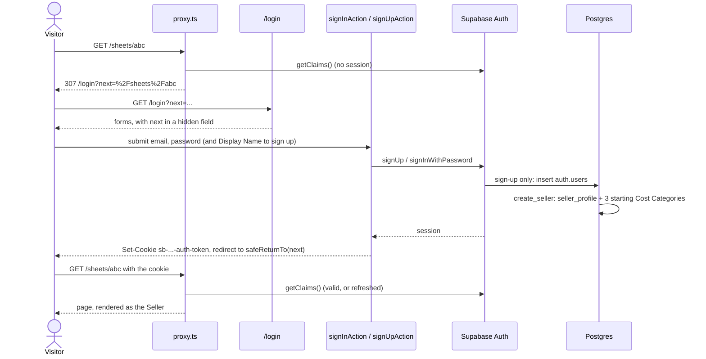
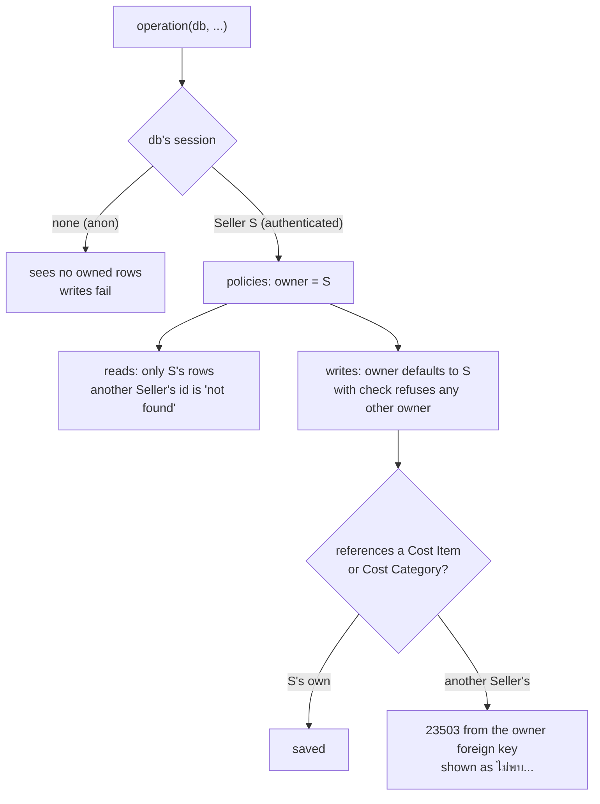

# Sign-in, sessions and row-level security

This page explains how a Seller signs up and signs in with email, how their session travels with each request, and how the database keeps each Seller to their own data. Seller and Display Name are defined in [GLOSSARY.md](../../GLOSSARY.md). Discord sign-in, the `/me` page and account deletion come in later tickets under `.scratch/auth/issues/`.

## The parts

| Part | Path | Job |
| --- | --- | --- |
| Login page | `src/app/login/page.tsx`, `login-forms.tsx` | A sign-in form and a sign-up form. `?next=` is the page to go to afterwards. A signed-in Seller who opens it goes straight there. |
| Auth actions | `src/app/login/actions.ts` | `signInAction`, `signUpAction` and `signOutAction`. Wiring only. |
| Auth operations | `src/server/auth.ts` | `signUpWithEmail`, `signInWithEmail`, `signOut` and `currentSeller`, plus `SignInError`. |
| Request client | `src/server/request-client.ts` | `requestClient()`: a new client per request, reading and writing the session cookies through `next/headers`. |
| Proxy | `src/proxy.ts`, `src/server/session.ts` | Runs before every page. Refreshes the session and sends signed-out visitors from the Seller pages to the login page. |
| Seller frame | `src/app/seller-shell.tsx`, used by `src/app/sheets/layout.tsx` and `src/app/cost-list/layout.tsx` | Checks the Seller again and shows the header: Display Name and ออกจากระบบ. |
| Return-to | `src/lib/return-to.ts` | `safeReturnTo` and `loginPath`. |
| Database | `supabase/migrations/20261010075658_seller_sign_in.sql` | Owners, row-level security policies, `seller_profile`, and the triggers on `auth.users`. |
| Auth settings | `supabase/config.toml`, `[auth]` and `[auth.email]` | `minimum_password_length = 8`, `enable_confirmations = false`. |

## Signing up and signing in

- Signing up needs no email confirmation, so the new Seller is signed in at once. The Display Name they typed is stored in the user's metadata as `display_name`, and the `create_seller` trigger copies it into `seller_profile` in the same transaction as the user.
- Passwords are at least 8 characters. `signUpWithEmail` checks this before calling Supabase Auth, and Auth itself refuses shorter ones (`minimum_password_length`). A password is never trimmed.
- After signing in or up, the action calls `revalidatePath('/', 'layout')`, so no page rendered for the signed-out visitor is reused, and redirects to `safeReturnTo(next)`.

### Errors the visitor sees

`src/server/auth.ts` turns Supabase Auth's error codes into a `SignInError` with a Thai message. Any other error is unexpected and is thrown.

| Case | Auth code | Message |
| --- | --- | --- |
| Wrong password, or no Seller with that email | `invalid_credentials` | อีเมลหรือรหัสผ่านไม่ถูกต้อง |
| Email already has a Seller | `user_already_exists`, `email_exists` | อีเมลนี้มีบัญชีอยู่แล้ว ลองเข้าสู่ระบบแทน |
| Password shorter than 8 | checked first; `weak_password` | รหัสผ่านต้องยาวอย่างน้อย 8 ตัวอักษร |
| Email Auth cannot accept | `email_address_invalid`, `validation_failed` | รูปแบบอีเมลไม่ถูกต้อง |
| Too many attempts | `over_request_rate_limit` | ลองหลายครั้งเกินไป รอสักครู่แล้วลองใหม่ |
| Blank email, password or Display Name | checked first | ต้องใส่อีเมล, ต้องใส่รหัสผ่าน, ต้องใส่ชื่อที่แสดง |

## The session

Supabase Auth's session (an access token and a refresh token) lives in `sb-<project>-auth-token` cookies, written by `@supabase/ssr`. Nothing else stores it.

- **The proxy refreshes it.** `refreshSession(request)` makes a client over the request's cookies and calls `getClaims()`, which verifies the access token and refreshes it if it has expired. New cookies go onto the request, so the page about to render reads them, and onto the response, so the browser keeps them, with no-cache headers.
- **Pages only read it.** Next lets a page read cookies but not write them while it renders, so `requestClient()` ignores a write it cannot make. The proxy has already refreshed the session for that request.
- **Actions read and write it.** In a server action, `requestClient()` writes cookies through `cookies()`. That is how signing in and out set and clear the session.
- **One client per request.** `requestClient()` makes a new client every call. A client holds one Seller's session and is never shared.

`currentSeller(db)` calls `getClaims()` too, so it trusts only a verified token, never the cookie alone, and then reads the Seller's `seller_profile`.

## Which pages need a Seller

`/sheets` and `/cost-list`, and every page under them, need a signed-in Seller. Two checks guard them:

1. The proxy, before the page renders. A signed-out visitor is redirected to `loginPath(pathname + search)`, which is `/login?next=…`. It is quick and runs on every navigation, including server action calls.
2. `SellerShell`, in the layout of each Seller section, calls `currentSeller`. If there is no Seller it redirects to `/login`. This is the check that verifies the session itself.

Neither check is what keeps data apart. Row-level security does that, so even a page that forgot its check would show a signed-out visitor nothing.

`safeReturnTo` accepts only a path on this site. It rejects `//host`, `/\host`, control characters, anything not starting with `/`, and the login page itself, and falls back to `/sheets`.

The root page `/` needs no sign-in. It reads `app_status`, which anyone may read.

## Signing out

The ออกจากระบบ button in the header posts to `signOutAction`. It calls `signOut(db)` with `scope: 'local'`, which ends this session at Supabase Auth and clears the cookies, then redirects to `/`. The refresh token stops working at once. An access token copied before signing out still verifies until it expires (`jwt_expiry`, one hour), because `getClaims` checks its signature locally rather than asking Supabase Auth.

## Row-level security

Every table has row-level security on. The policies:

| Table | Role | Allowed |
| --- | --- | --- |
| `cost_category`, `cost_item`, `cost_sheet`, `cost_line` | `authenticated` | Everything, on rows where `owner = auth.uid()`. A new row must have that owner too. |
| `seller_profile` | `authenticated` | Read and update the row whose `id = auth.uid()`. No insert or delete: the triggers do both. |
| `app_status` | `anon`, `authenticated` | Read. |

`anon`, a visitor who is not signed in, has no other policy, so sees no Seller's data. `owner` defaults to `auth.uid()`, so the app never sends it, and the policies refuse any other value.

Policies alone are not enough. Postgres checks a foreign key without row-level security, so a plain `cost_item_id` would let Seller B link a line to Seller A's Cost Item by its id. Each reference between owned tables is therefore a foreign key that includes `owner`, such as `(owner, cost_item_id)` pointing at `cost_item (owner, id)`. It matches only a row of the same owner, and B gets the same `23503` as for an item that does not exist. [Data model](data-model.md) lists the keys.

The Postgres functions `save_cost_sheet`, `duplicate_cost_sheet` and `delete_cost_item` run as the caller, so the policies apply inside them: B's call to save A's sheet updates nothing and raises "not found".

## A new Seller

The `create_seller` trigger runs after Supabase Auth inserts a user, in the same transaction. It makes:

- the `seller_profile` row, with the Display Name from the sign-up metadata (`display_name`, else `full_name`, else `name`, else the part of the email before `@`);
- the three starting Cost Categories, วัตถุดิบ, บรรจุภัณฑ์ and อื่น ๆ, owned by the new Seller.

A Seller therefore never exists without them. Deleting a Seller's auth user deletes the profile and all their data: `delete_seller_sheets` deletes their sheets first, and the owner keys cascade to the rest.

## The secret key

`createSecretClient()` has the `service_role`, which bypasses row-level security. Nothing a Seller does runs through it. Tests use it to create and delete Sellers, and admin-only operations, such as deleting an account, will use it. The app's pages and actions use the publishable key with the Seller's session.

## The test Seller

`supabase/seed.sql` creates a Seller who owns the sample data:

| Email | Password | Display Name |
| --- | --- | --- |
| `seller@gumrai.test` | `gumrai-test-1234` | ร้านทดสอบ |

The seed inserts the user straight into `auth.users` and `auth.identities`, as Supabase Auth would store an email sign-up, so the trigger makes the profile and categories and the sample rows then use the Seller's id.
