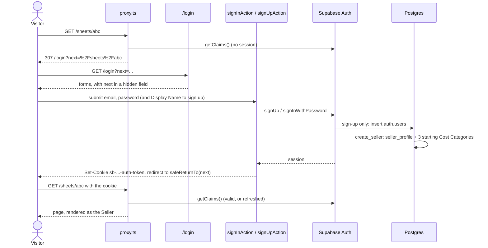
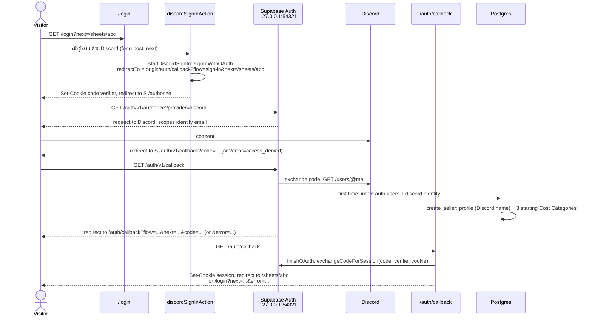
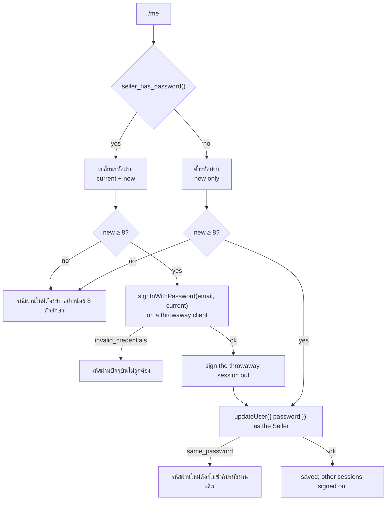
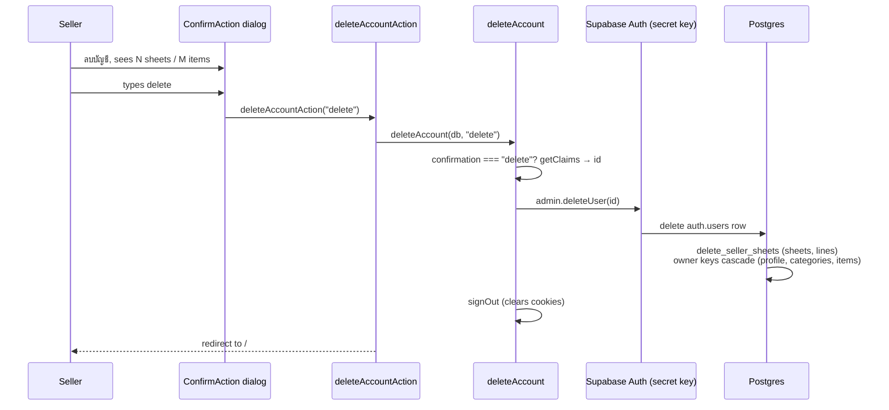
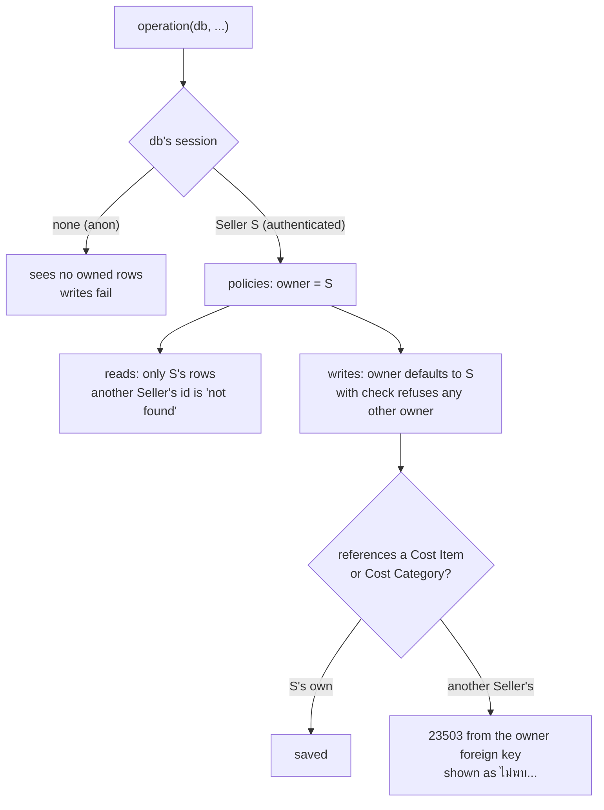

# Sign-in, sessions and row-level security

This page explains how a Seller signs up and signs in with email or Discord, how their session travels with each request, how they change their Display Name and password and delete their account at `/me`, and how the database keeps each Seller to their own data. Seller and Display Name are defined in [GLOSSARY.md](../../GLOSSARY.md). Binding and unbinding sign-in methods at `/me` comes in a later ticket under `.scratch/auth/issues/`.

## The parts

| Part | Path | Job |
| --- | --- | --- |
| Login page | `src/app/login/page.tsx`, `login-forms.tsx` | A เข้าสู่ระบบด้วย Discord button, a sign-in form and a sign-up form. `?next=` is the page to go to afterwards; `?error=` is a Discord failure to explain. A signed-in Seller who opens it goes straight there. |
| Auth actions | `src/app/login/actions.ts` | `signInAction`, `signUpAction`, `discordSignInAction` and `signOutAction`. Wiring only. |
| Auth operations | `src/server/auth/auth.ts` | `signUpWithEmail`, `signInWithEmail`, `signOut` and `currentSeller`, plus `SignInError`. |
| OAuth operations | `src/server/auth/oauth.ts` | `startDiscordSignIn`, `finishOAuth`, `oauthCallbackUrl` and `oauthFailureMessage`. |
| OAuth callback | `src/app/auth/callback/route.ts` | A Route Handler: `GET /auth/callback` calls `finishOAuth` and redirects where it says. Wiring only. |
| Header avatar | `src/app/seller-avatar.tsx`, `src/lib/avatar.ts` | The Discord avatar, or the Display Name's first letter (`sellerAvatar`). |
| Request client | `src/server/db/request-client.ts` | `requestClient()`: a new client per request, reading and writing the session cookies through `next/headers`. |
| Proxy | `src/proxy.ts`, `src/server/db/session.ts` | Runs before every page. Refreshes the session and sends signed-out visitors from the Seller pages to the login page. |
| Seller frame | `src/app/seller-shell.tsx`, used by the layouts of `src/app/sheets/`, `src/app/cost-list/` and `src/app/me/` | Checks the Seller again and shows the header: the avatar and Display Name, which link to `/me`, and ออกจากระบบ. |
| Account page | `src/app/me/page.tsx`, `account-forms.tsx`, `actions.ts` | `/me`: rename the Display Name, change or set the password, delete the account, ออกจากระบบ. |
| Account operations | `src/server/auth/account.ts` | `readAccount`, `renameDisplayName`, `changePassword`, `setFirstPassword`, `countAccountData` and `deleteAccount`, plus `AccountError`. |
| Return-to | `src/lib/return-to.ts` | `safeReturnTo` and `loginPath`. |
| Database | `supabase/migrations/20261010075658_seller_sign_in.sql`, `20261010083051_discord_sign_in.sql` | Owners, row-level security policies, `seller_profile`, the triggers on `auth.users`, and `seller_discord_avatar()`. |
| Auth settings | `supabase/config.toml`, `[auth]`, `[auth.email]` and `[auth.external.discord]` | `minimum_password_length = 8`, `enable_confirmations = false`, the callback in `additional_redirect_urls`, and the Discord provider with its client ID and secret from the environment. |

## Signing up and signing in

- Signing up needs no email confirmation, so the new Seller is signed in at once. The Display Name they typed is stored in the user's metadata as `display_name`, and the `create_seller` trigger copies it into `seller_profile` in the same transaction as the user.
- Passwords are at least 8 characters. `signUpWithEmail` checks this before calling Supabase Auth, and Auth itself refuses shorter ones (`minimum_password_length`). A password is never trimmed.
- After signing in or up, the action calls `revalidatePath('/', 'layout')`, so no page rendered for the signed-out visitor is reused, and redirects to `safeReturnTo(next)`.

### Errors the visitor sees

`src/server/auth/auth.ts` turns Supabase Auth's error codes into a `SignInError` with a Thai message. Any other error is unexpected and is thrown.

| Case | Auth code | Message |
| --- | --- | --- |
| Wrong password, or no Seller with that email | `invalid_credentials` | อีเมลหรือรหัสผ่านไม่ถูกต้อง |
| Email already has a Seller | `user_already_exists`, `email_exists` | อีเมลนี้มีบัญชีอยู่แล้ว ลองเข้าสู่ระบบแทน |
| Password shorter than 8 | checked first; `weak_password` | รหัสผ่านต้องยาวอย่างน้อย 8 ตัวอักษร |
| Email Auth cannot accept | `email_address_invalid`, `validation_failed` | รูปแบบอีเมลไม่ถูกต้อง |
| Too many attempts | `over_request_rate_limit` | ลองหลายครั้งเกินไป รอสักครู่แล้วลองใหม่ |
| Blank email, password or Display Name | checked first | ต้องใส่อีเมล, ต้องใส่รหัสผ่าน, ต้องใส่ชื่อที่แสดง |

## Signing in with Discord

Supabase Auth runs the OAuth flow with Discord, with PKCE. The app never sees a Discord token; it gets a Supabase session like an email sign-in does. Setting up the Discord Application is in [Onboarding](ONBOARDING.md#set-up-discord-sign-in).

- **Starting.** `discordSignInAction` takes the site's origin from the form post's `Origin` header and calls `startDiscordSignIn(db, origin, next)`. It must run in a server action: `signInWithOAuth` keeps the PKCE code verifier in a cookie (`sb-…-auth-token-code-verifier`) until the callback, and a page cannot write cookies.
- **The callback is a Route Handler**, `src/app/auth/callback/route.ts`, for the same reason: exchanging the code writes the session cookies. It calls `finishOAuth(db, searchParams)`, revalidates every page and redirects to the path `finishOAuth` returns.
- **The callback URL carries the flow and the return-to page**: `/auth/callback?flow=sign-in&next=…`, built by `oauthCallbackUrl`. `next` goes through `safeReturnTo` both when the URL is built and when it is read. `flow` says where a failure goes back to: for `sign-in`, the login page as `/login?next=…&error=<failure>`. An unknown `flow` is treated as `sign-in`. Binding Discord from `/me` (ticket 06) adds a flow that fails back to `/me`.
- **Supabase Auth checks the callback URL.** It accepts a `redirectTo` on the host of `site_url` (`http://127.0.0.1:3000`) or one matching `additional_redirect_urls` (`http://127.0.0.1:3000/auth/callback**`). Any other one is silently replaced by `site_url`, so the visitor lands on `/` with nothing to finish the flow.
- **The app must be opened at 127.0.0.1, not localhost.** Cookies belong to a host, so the code verifier set on `localhost:3000` is not sent to `127.0.0.1:3000`. Worse, a `localhost` callback URL is not allowed (above), so Supabase Auth sends the visitor to `http://127.0.0.1:3000/` instead. Either way the sign-in fails.
- **A first Discord sign-in makes a new Seller.** Supabase Auth inserts the auth user with Discord's profile as its metadata, and `create_seller` makes the profile and the starting Cost Categories ([A new Seller](#a-new-seller)). Supabase Auth does not ask for email confirmation here (`enable_confirmations = false`). A later sign-in with the same Discord account finds the `discord` identity and signs into the same Seller. After that Seller deletes their account, the identity is gone too, so the next Discord sign-in makes a new Seller from scratch.
- **A Discord email that already belongs to a Seller.** Supabase Auth links identities by email automatically (`DetermineAccountLinking` in supabase/auth `internal/models/linking.go`): a first Discord sign-in whose email matches an existing Seller signs into that Seller and adds a `discord` identity to them, rather than making a second Seller. It counts an email as verified when Discord says so **or when email confirmations are off**, which they are here (`mailer_autoconfirm`), so locally even a Discord account with an unverified email is linked. Turning on manual linking (`enable_manual_linking`) does not stop this. Whether to accept this is still open (ticket 06, `.scratch/auth/issues/06-me-bound-sign-in-methods.md`).

### Discord errors the visitor sees

Supabase Auth puts what went wrong on the callback URL as `error`, `error_code` and `error_description` (in the query and again in the fragment; the Route Handler reads the query). `finishOAuth` turns it into an `OAuthFailure`, which goes to the login page as `?error=`, and the page shows `oauthFailureMessage(error)`. Any other `?error=` shows nothing.

| Case | What Supabase Auth sends | `?error=` | Message |
| --- | --- | --- | --- |
| The visitor pressed Cancel on Discord's consent screen | `error=access_denied`, no `error_code` | `cancelled` | ยกเลิกการเข้าสู่ระบบด้วย Discord แล้ว ลองอีกครั้ง หรือเข้าสู่ระบบด้วยอีเมลแทน |
| The Discord account has no email (`email_optional = false`) | `error=server_error`, `error_description=Error getting user email from external provider` | `no_email` | บัญชี Discord นี้ไม่มีอีเมล เพิ่มอีเมลในบัญชี Discord ก่อน แล้วลองอีกครั้ง |
| The Discord email is not verified (only if email confirmations are turned on) | `error_code=provider_email_needs_verification` | `unverified_email` | อีเมลในบัญชี Discord นี้ยังไม่ได้ยืนยัน ยืนยันอีเมลใน Discord ก่อน แล้วลองอีกครั้ง |
| Anything else: no code, an expired state, or a code that cannot be exchanged (no code verifier cookie, used twice) | anything | `failed` | เข้าสู่ระบบด้วย Discord ไม่สำเร็จ ลองอีกครั้ง |

A failed code exchange is also logged on the server with Supabase Auth's error code.

### The header's avatar

The header shows the Seller's Discord avatar when they have Discord bound, and the first letter of the Display Name otherwise (`sellerAvatar` in `src/lib/avatar.ts`: the first letter or digit without the marks over or under it, so ร้านทดสอบ gives ร). `currentSeller` returns `discordAvatarUrl` from `seller_discord_avatar()`, which reads the avatar from the Seller's own `discord` identity ([Data model](data-model.md#postgres-functions)). The identity, not the user's metadata, because Supabase Auth refreshes the identity on every Discord sign-in and when Discord is bound later, but binding does not touch the metadata, and a Seller can write their own metadata. Only a URL on `https://cdn.discordapp.com/` is shown. The avatar follows Discord; the Display Name does not.

## The session

Supabase Auth's session (an access token and a refresh token) lives in `sb-<project>-auth-token` cookies, written by `@supabase/ssr`. Nothing else stores it.

- **The proxy refreshes it.** `refreshSession(request)` makes a client over the request's cookies and calls `getClaims()`, which verifies the access token and refreshes it if it has expired. New cookies go onto the request, so the page about to render reads them, and onto the response, so the browser keeps them, with no-cache headers.
- **Pages only read it.** Next lets a page read cookies but not write them while it renders, so `requestClient()` ignores a write it cannot make. The proxy has already refreshed the session for that request.
- **Actions read and write it.** In a server action, `requestClient()` writes cookies through `cookies()`. That is how signing in and out set and clear the session.
- **One client per request.** `requestClient()` makes a new client every call. A client holds one Seller's session and is never shared.

`currentSeller(db)` calls `getClaims()` too, so it trusts only a verified token, never the cookie alone, and then reads the Seller's `seller_profile`.

## Which pages need a Seller

`/sheets`, `/cost-list` and `/me`, and every page under them, need a signed-in Seller (`SELLER_PAGES` in `src/proxy.ts`). Two checks guard them:

1. The proxy, before the page renders. A signed-out visitor is redirected to `loginPath(pathname + search)`, which is `/login?next=…`. It is quick and runs on every navigation, including server action calls.
2. `SellerShell`, in the layout of each Seller section, calls `currentSeller`. If there is no Seller it redirects to `/login`. This is the check that verifies the session itself.

Neither check is what keeps data apart. Row-level security does that, so even a page that forgot its check would show a signed-out visitor nothing.

`safeReturnTo` accepts only a path on this site. It rejects `//host`, `/\host`, control characters, anything not starting with `/`, and the login page itself, and falls back to `/sheets`.

The root page `/` is the public landing page. It needs no sign-in and is not in `SELLER_PAGES`, and it never redirects a signed-in Seller away. It calls `currentSeller` only to choose its main button: เริ่มใช้งาน to `/login` for a visitor, ไปที่ชีตต้นทุน to `/sheets` for a Seller.

`/login` and the OAuth callback `/auth/callback` are public too: a visitor reaches both before they have a session.

## The account page, /me

`/me` shows the Seller's email and has one card for the Display Name, one for the password and one for deleting the account, then an ออกจากระบบ button. The header's Display Name links here. Every operation in `src/server/auth/account.ts` acts on the Seller whose session `db` holds, and refuses with ต้องเข้าสู่ระบบก่อน when there is none.

- **Display Name.** `renameDisplayName(db, name)` trims the name, refuses a blank one, and updates the Seller's own `seller_profile` row with their session client; the row-level security policy allows only that row. The check constraint `btrim(display_name) <> ''` refuses a blank name again in the database. The action revalidates every page, so the header shows the new name.
- **Has a password or not.** `readAccount` asks the database through `seller_has_password()` ([Data model](data-model.md#postgres-functions)). A Seller who only signed in with Discord has an empty password hash. Supabase Auth's identities cannot answer this, because setting a password later adds no `email` identity.
- **Changing the password** (เปลี่ยนรหัสผ่าน, shown when the Seller has one). The current password is checked by signing in with it on a throwaway client (`createPublicClient()`), so the request's session is never touched, and that extra session is signed out at once. Then `updateUser({ password })` on the Seller's own client saves the new one. Supabase Auth signs out the Seller's other sessions and keeps this one.
- **Setting a first password** (ตั้งรหัสผ่าน, shown instead when the Seller has none). No current password is asked for. Afterwards the Seller can also sign in on the login page with their email (the one Discord gave) and this password. `setFirstPassword` refuses a Seller who already has a password, so it can never be used to skip the current-password check.

### Errors on /me

| Case | Message |
| --- | --- |
| Blank Display Name | ต้องใส่ชื่อที่แสดง |
| Wrong current password (`invalid_credentials`) | รหัสผ่านปัจจุบันไม่ถูกต้อง |
| Blank current password | ต้องใส่รหัสผ่านปัจจุบัน |
| New password shorter than 8 (checked first; `weak_password`) | รหัสผ่านใหม่ต้องยาวอย่างน้อย 8 ตัวอักษร |
| New password equals the current one (`same_password`) | รหัสผ่านใหม่ต้องไม่ซ้ำกับรหัสผ่านเดิม |
| Changing when there is no password | บัญชีนี้ยังไม่มีรหัสผ่าน ตั้งรหัสผ่านแทน |
| Setting a first password when there is one | บัญชีนี้มีรหัสผ่านอยู่แล้ว เปลี่ยนรหัสผ่านแทน |
| Deleting the account with any text but exactly `delete` | พิมพ์ delete เพื่อยืนยันการลบบัญชี |
| Too many attempts (`over_request_rate_limit`) | ลองหลายครั้งเกินไป รอสักครู่แล้วลองใหม่ |

### Deleting the account

The last card on `/me`, before ออกจากระบบ, is ลบบัญชี. Its button opens a `ConfirmAction` dialog whose text, in Thai, states how many Cost Sheets and Cost Items will be lost (`countAccountData(db)`, which counts through row-level security, so only the Seller's own rows). The dialog has a field, and its ลบบัญชี button stays disabled until the Seller types exactly `delete`. What they typed is sent to `deleteAccountAction`, and `deleteAccount(db, confirmation)` checks it again: anything but exactly `delete` (no trimming, no other case) is refused with พิมพ์ delete เพื่อยืนยันการลบบัญชี and nothing is deleted.

Deleting an auth user is admin-only in Supabase Auth, so `deleteAccount` is the one operation outside tests that uses the secret key. It takes the id from the verified session (`getClaims`), never from the request, and calls `auth.admin.deleteUser(id)`. The `delete_seller_sheets` trigger deletes the sheets and their lines first; the owner keys cascade to the profile, Cost Categories and Cost Items ([Data model](data-model.md#triggers-on-authusers)). Supabase Auth deletes the user's sessions and identities with it. Then `signOut` on the request client clears the session cookies (Supabase Auth's 404 or 403 for the already-gone session is ignored by supabase-js), and the action revalidates every page and redirects to `/`.

A crafted request with the wrong text gets the `AccountError` thrown from the action, as other delete actions throw; the dialog never sends it.

## Signing out

The ออกจากระบบ button in the header, and the one on `/me`, posts to `signOutAction`. It calls `signOut(db)` with `scope: 'local'`, which ends this session at Supabase Auth and clears the cookies, then redirects to `/`. The refresh token stops working at once. An access token copied before signing out still verifies until it expires (`jwt_expiry`, one hour), because `getClaims` checks its signature locally rather than asking Supabase Auth.

## Row-level security

Every table has row-level security on. The policies:

| Table | Role | Allowed |
| --- | --- | --- |
| `cost_category`, `cost_item`, `cost_sheet`, `cost_line` | `authenticated` | Everything, on rows where `owner = auth.uid()`. A new row must have that owner too. |
| `seller_profile` | `authenticated` | Read and update the row whose `id = auth.uid()`. No insert or delete: the triggers do both. |

`anon`, a visitor who is not signed in, has no policy at all, so sees no Seller's data. `owner` defaults to `auth.uid()`, so the app never sends it, and the policies refuse any other value.

Policies alone are not enough. Postgres checks a foreign key without row-level security, so a plain `cost_item_id` would let Seller B link a line to Seller A's Cost Item by its id. Each reference between owned tables is therefore a foreign key that includes `owner`, such as `(owner, cost_item_id)` pointing at `cost_item (owner, id)`. It matches only a row of the same owner, and B gets the same `23503` as for an item that does not exist. [Data model](data-model.md) lists the keys.

The Postgres functions `save_cost_sheet`, `duplicate_cost_sheet` and `delete_cost_item` run as the caller, so the policies apply inside them: B's call to save A's sheet updates nothing and raises "not found".

## A new Seller

The `create_seller` trigger runs after Supabase Auth inserts a user, in the same transaction. It makes:

- the `seller_profile` row, with the Display Name from the user's metadata: `display_name` (what an email sign-up typed), else `custom_claims.global_name` (the display name chosen on Discord), else `full_name` (the Discord username), else `name`, else the part of the email before `@`;
- the three starting Cost Categories, วัตถุดิบ, บรรจุภัณฑ์ and อื่น ๆ, owned by the new Seller.

A Seller therefore never exists without them.

Supabase Auth's Discord provider (`internal/api/provider/discord.go` in supabase/auth) stores the Discord user's username as `full_name`, `<username>#<discriminator>` as `name`, and their chosen display name only under `custom_claims.global_name` (an empty string when they have none). That is why `global_name` comes before `full_name`. The trigger runs only when the auth user is inserted. Supabase Auth rewrites the metadata on every later Discord sign-in, but nothing copies it to `seller_profile` again, so a Discord name changed later never changes the Display Name. Deleting a Seller's auth user deletes the profile and all their data: `delete_seller_sheets` deletes their sheets first, and the owner keys cascade to the rest.

## The secret key

`createSecretClient()` has the `service_role`, which bypasses row-level security. Nothing else a Seller does runs through it. Tests use it to create and delete Sellers. Outside tests only `deleteAccount` uses it, because deleting an auth user is admin-only; it deletes only the id the Seller's verified session names. The app's pages and actions use the publishable key with the Seller's session.

## The test Seller

`supabase/seed.sql` creates a Seller who owns the sample data:

| Email | Password | Display Name |
| --- | --- | --- |
| `seller@gumrai.test` | `gumrai-test-1234` | ร้านทดสอบ |

The seed inserts the user straight into `auth.users` and `auth.identities`, as Supabase Auth would store an email sign-up, so the trigger makes the profile and categories and the sample rows then use the Seller's id.
